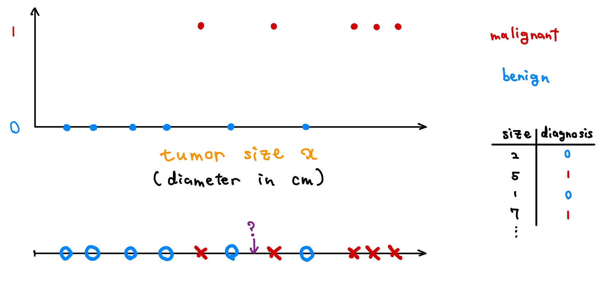
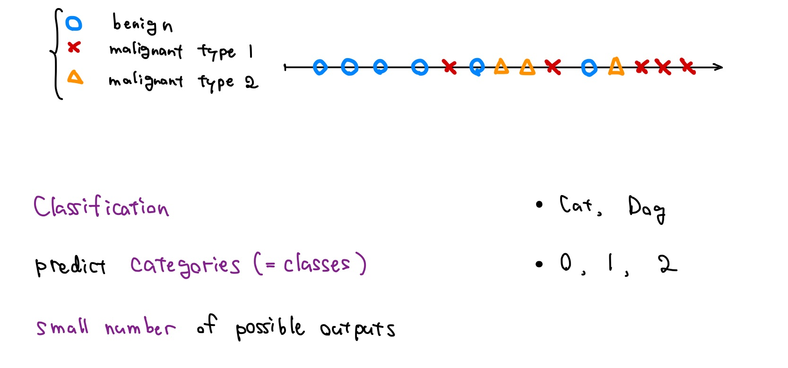
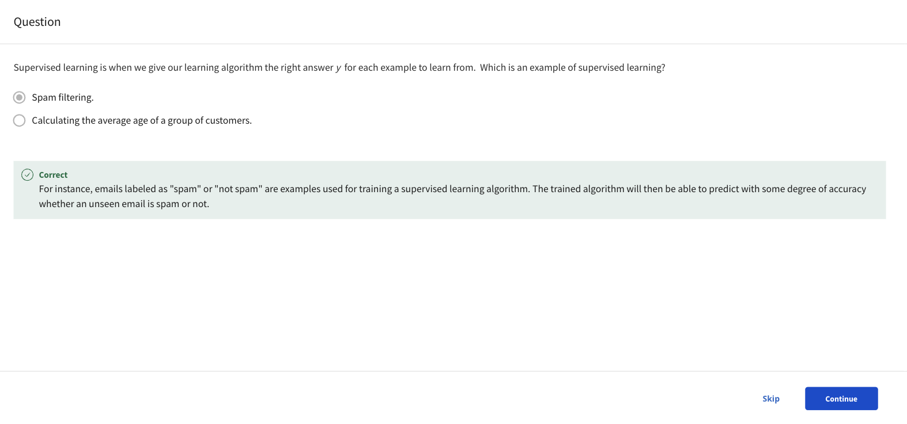

# Supervised vs. Unsupervised Machine Learning

## What is machine learning?

- Q:

  

- Machine learning algorithms

  - **Supervised learning**: Course 1, 2

    - rapid advancements
    - used most in real-world applications

  - **Unsupervised learning**: Course 3
  - **Recommender systems**: Course 3
  - **Reinforcement learning**: Course 3

> [!IMPORTANT]
>
> Practical advice for applying learning algorithms

## Supervised learning part 1

- I think **99 percent** of the economic value created by machine learning today is through one type of machine learning, which is called **supervised learning**.

- Learns from **being given "right answers"**

  | Input (X)         | Output (Y)             | Application         |
  | ----------------- | ---------------------- | ------------------- |
  | email             | spam? (0/1)            | spam filtering      |
  | audio             | text transcripts       | speech recognition  |
  | English           | Japanese               | machine translation |
  | ad, user info     | click? (0/1)           | online advertising  |
  | image, radar info | position of other cars | self-driving car    |
  | image of phone    | defect? (0/1)          | visual inspection   |

- **Regression**: Housing price prediction

  

## Supervised learning part 2

- **Classification**: Breast cancer detection

  

  

- Two or more inputs

  

> [!IMPORTANT]
>
> **Supervised learning**: Learns from **being given "right answers"**
>
> - **Regression**
>
>   - predict a **number**
>   - (from) **infinitely** many possible outputs
>
> - **Classification**
>
>   - predict **categories** (= **classes**)
>   - (from) **small number** of possible outputs

- Q:

  

## Unsupervised learning part 1

- (L) Supervised learning: Learn from data **labeled** with the "**right answers**"

- (R) **Un**supervised learning: Find something interesting in **unlabeled** data.

  

- **Clustering**

  - Google news
  - Grouping customers
  - DNA microarray

  

## Unsupervised learning part 2

> [!IMPORTANT]
>
> **Unsupervised learning**:
>
> Data only comes with inputs x, but **not output labels y**.  
> Algorithm has to find **structure** in the data.
>
> - **Clustering**: Group similar data points together.
>
> - **Anomaly detection**: Find unusual data points.
>
> - **Dimensionality reduction**: Compress data using fewer numbers.

- Q:

  

## Jupyter Notebooks

## Python and Jupyter Notebooks
