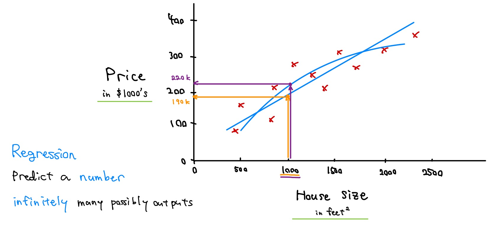
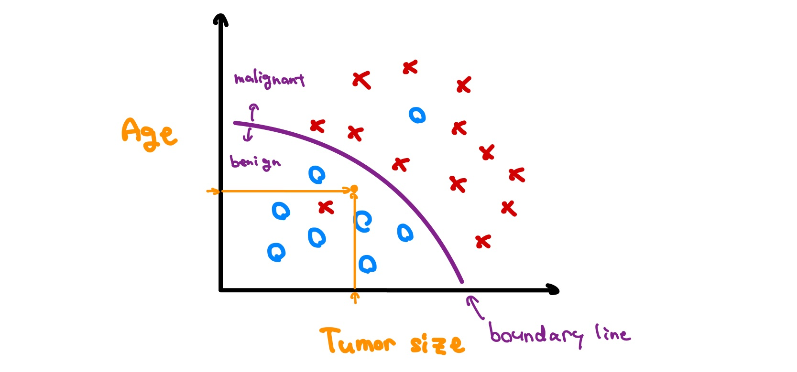
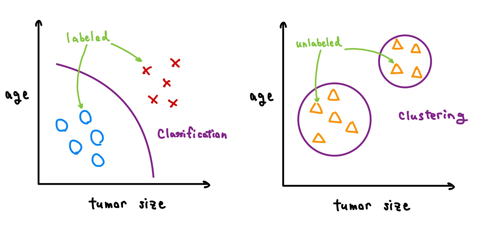

# Supervised vs. Unsupervised Machine Learning

## What is machine learning?

- Machine learning algorithms

  - **Supervised learning**: Course 1, 2

    - rapid advancements
    - used most in real-world applications

  - **Unsupervised learning**: Course 3
  - **Recommender systems**: Course 3
  - **Reinforcement learning**: Course 3

> [!IMPORTANT]
> Practical advice for applying learning algorithms

## Supervised learning part 1

- I think **99 percent** of the economic value created by machine learning today is through one type of machine learning, which is called **supervised learning**.

- Learns from **being given "right answers"**

  | Input (X)         | Output (Y)             | Application         |
  | ----------------- | ---------------------- | ------------------- |
  | email             | spam? (0/1)            | spam filtering      |
  | audio             | text transcripts       | speech recognition  |
  | English           | Japanese               | machine translation |
  | ad, user info     | click? (0/1)           | online advertising  |
  | image, radar info | position of other cars | self-driving car    |
  | image of phone    | defect? (0/1)          | visual inspection   |

- **Regression**: Housing price prediction

  

## Supervised learning part 2

- **Classification**: Breast cancer detection

  
  

- Two or more inputs

  

> [!IMPORTANT]
>
> **Supervised learning**:
>
> 

## Unsupervised learning part 1

## Unsupervised learning part 2

## Jupyter Notebooks

## Python and Jupyter Notebooks
