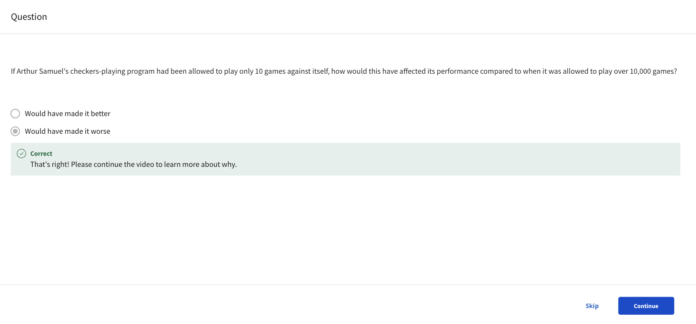

# Supervised vs. Unsupervised Machine Learning

## What is machine learning?

- Machine learning algorithms

  - **Supervised learning**: Course 1, 2

    - rapid advancements
    - used most in real-world applications

  - **Unsupervised learning**: Course 3
  - **Recommender systems**: Course 3
  - **Reinforcement learning**: Course 3

> [!IMPORTANT]
> Practical advice for applying learning algorithms

## Supervised learning part 1

## Supervised learning part 2

## Unsupervised learning part 1

## Unsupervised learning part 2

## Jupyter Notebooks

## Python and Jupyter Notebooks
