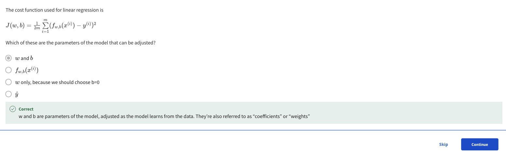
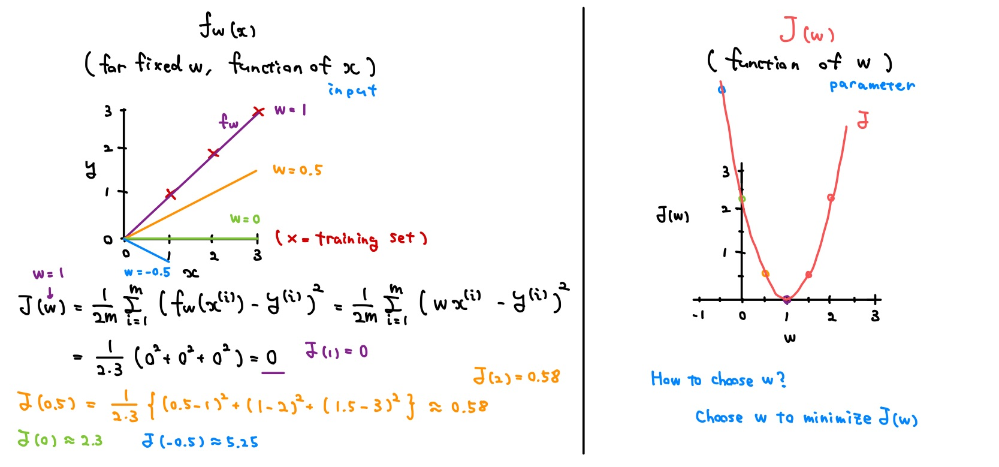

# Regression Model

## Linear regression model part 1

- Terminology & Notation:

  - **Training set**: Data used to train the model

  - x = "input" variable / feature
  - y = "output" variable / "target" variable
  - m = number of training examples
  - (x, y) = single training example
  - (x(i), y(i)) = ith training example

- e.g.:

  

  - x(1) = 2502
  - y(1) = 280

  - m = 18

  - (x(1), y(1)) = (2502, 280)
  - x(2) = 1010
    - x(2) ≠ x2 ... not exponent!

## Linear regression model part 2

- The process of how supervised learning works:

  

- Q:

  

## Optional lab: Model representation

## Cost function formula

- Model: **fw,b**(x) = **w**x + **b**

  - **w, b**: **parameters** (coefficients, weights)

  

- Cost function: **J(w, b)**

  - **1 / m**: To build a cost function that doesn't automatically get bigger as the training set size gets larger (by convention)

  - The extra division by **2** is just meant to make some of our later calculations **look neater**.

  - Eventually we're going to want to find values of **w** and **b** that make the **cost function small**.

  

- Q:

  

## Cost function intuition

- General case:

  - Model: fw,b(x) = wx + b

  - Parameters: w, b

  - Cost function: J(w, b) = (1 / 2m) \* Σi=1m (fw,b(x(i)) - y(i))2

  - Goal: **minimizew, b J(w, b)**

    - Find the values of w, and b that minimize the cost function (to get the best fit line)

- Simplified case (b = ø):

  - fw(x) = wx

  - w

  - J(**w**) = (1 / 2m) \* Σi=1m (f**w**(x(i)) - y(i))2

    - (= (1 / 2m) \* Σi=1m (**w**x(i) - y(i))2)

  - minimizew J(w)

  

- Relationship between w, fw(x), and J(w):

  - Choosing a value for the parameter **w** specifies **a line function f(x)** on the left graph and **a single point** on the right graph.

  

- Q:

  

## Visualizing the cost function

- General case:

  - Model: fw,b(x) = wx + b

  - Parameters: w, b

  - Cost function: J(w, b) = (1 / 2m) \* Σi=1m (fw,b(x(i)) - y(i))2

  - Goal: minimizew, b J(w, b)

- Relationship between w, b, fw,b(x) and J(w, b):

  

## Visualization examples

- minimizew, b J(w, b):

  

- In linear regression, manually reading a contour plot to find the best values for parameters **w** and **b** is not efficient or scalable for complex machine learning models. Instead, an algorithmic approach, such as **gradient descent**, is preferred for automatically finding these values that **minimize** the cost function **J**. Gradient descent is a crucial algorithm in machine learning.

## Optional lab: Cost function
