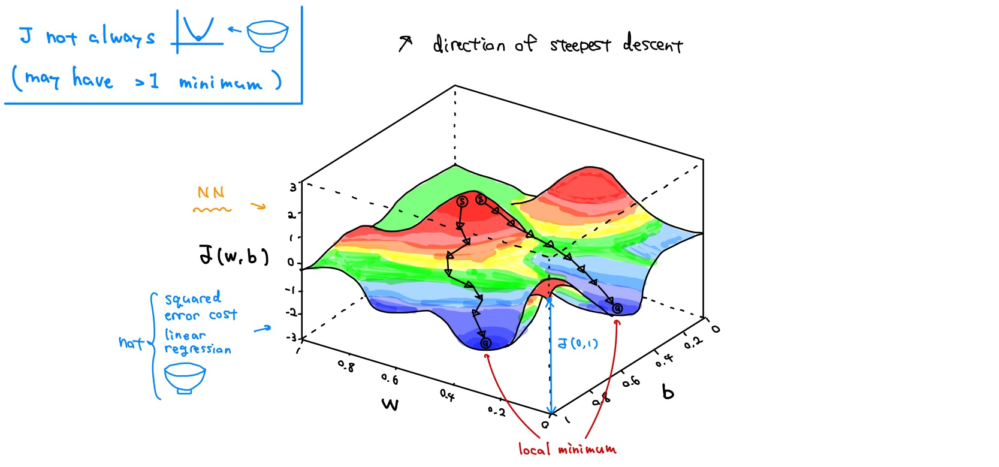
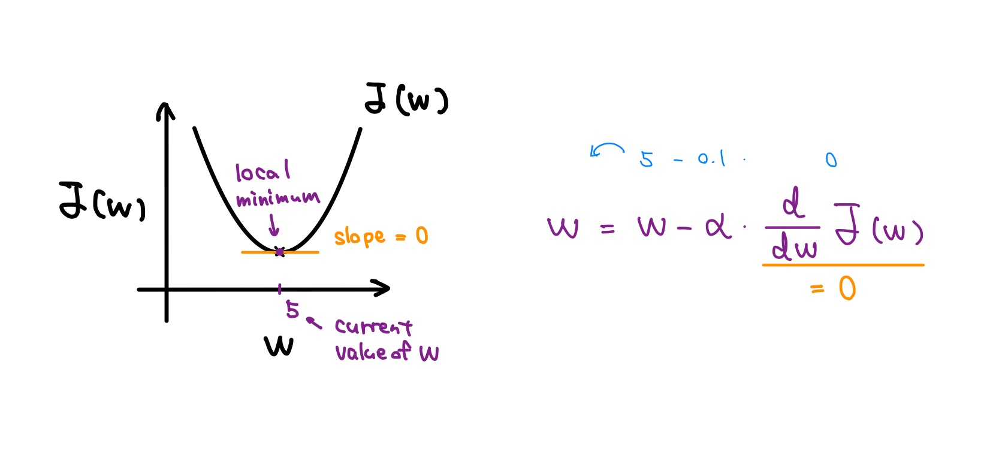
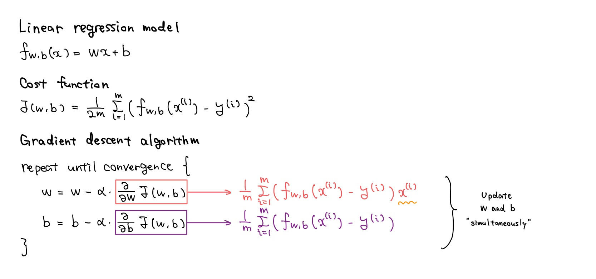

# Train the model with gradient descent

## Gradient descent

- Gradient descent is a **crucial** algorithm not only in linear regression, but also across **all areas of machine learning** (including deep learning).

- Gradient descent is an optimization algorithm that you can use to try to **minimize any function**, not just a cost function for linear regression.

  - minw1,...,wn,b J(w1,...,wn,b)

- Gradient descent:

  - Situation:

    - Have some function J(w, b)
    - Want minw, b J(w, b)

  - Outline:

    - Start with some w, b (e.g. set w=0, b=0) &larr; initial guesses
    - Keep changing w, b to reduce J(w, b) until we settle at or near a minimum

- Note:

  

## Implementing gradient descent

- **Gradient descent algorithm**:

  - **Learning rate**: Controls the **step size** during each iteration of gradient descent.

  - **Derivative**: Indicates the **direction** of the steepest ascent. Gradient descent moves in the opposite direction, i.e., the direction of the steepest descent.

  - In locations where the gradient (dJ(w) / dw) is large, the parameter update size (α \* dJ(w) / dw) is also large.

  - Convergence refers to reaching a **local minimum** where parameters w and b barely change with additional steps taken.

  

- Q:

  

## Gradient descent intuition

- Simplified case(b = ø or <a href="https://github.com/shisotem/stanford-andrew-ng-ml-dl/blob/main/s1_machine_learning_specialization/c1_supervised_machine_learning_regression_and_classification/w1_introduction_to_machine_learning/06_train_the_model_with_gradient_descent/resources/notes/01.jpg">fixed &larr; considering only the components of w<a>):

  - J(w)

  - w = w - &alpha; \* dJ(w) / dw

  - minw J(w)

  

  

- Q:

  

## Learning rate

- w = w - &alpha; \* dJ(w) / dw

  - If &alpha; is too **small**, gradient descent may be **slow**.

  - If &alpha; is too **large**, gradient descent may:
    - **Overshoot**, never reach minimum
    - Fail to converge, **diverge**

  

- Can reach local minimum without decreasing learning rate &alpha;.

  - Near a local minimum,

    - **Derivative** becomes smaller
    - **Update steps** become smaller

  

## Gradient descent for linear regression

- Gradient descent for linear regression:

  

  

- Issues with Gradient Descent:

  - Depending on the **initial guesses**, it may converge to a local minimum that is **not the global minimum**.

- **Convex Function**:

  - **Squared error cost function** is **always** a convex function.

  - Convex function cannot have any local minimum other than the **single global minimum**.

  - So, implementing gradient descent on a convex function has a beneficial property: if the learning rate is chosen correctly, it will always converge to the global minimum.

  

## Running gradient descent

- The model f(x), obtained after applying gradient descent, can be used to predict the price of new houses.

  

- To be more precise, the gradient descent process we've discussed so far is called **"batch" gradient descent**.

  - **"batch"**: Each step of gradient descent uses **all** the training examples (w = w - α \* (1 / m) \* **&Sigma;i=1m** (fw,b(x(i)) - y(i)) \* x(i))

  - (&harr; other gradient descent: subsets)

## Optional lab: Gradient descent
