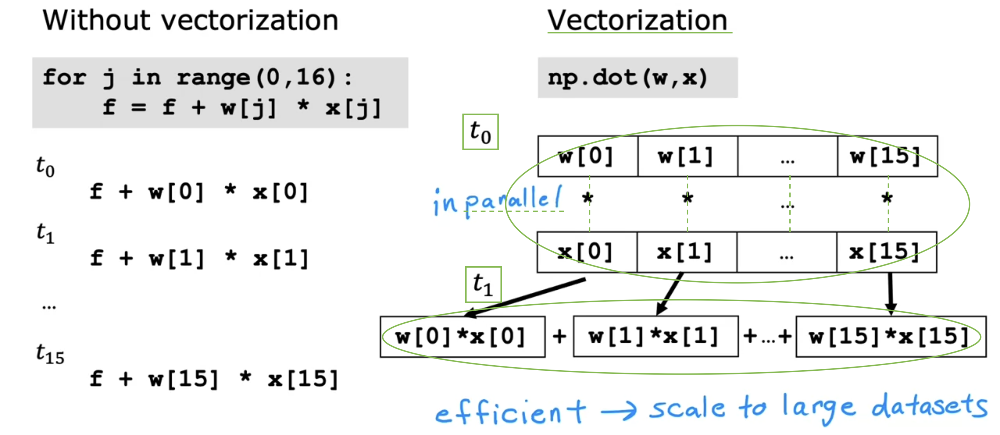

# Multiple linear regression

## Multiple features

- Review: Univariate Linear Regression

  

- Multiple Features & Notation

  

- Model of Multiple Linear Regression

  - **Multiple Linear Regression**: This is a type of linear regression that uses **multiple features**.

    - A model with **n features** can be represented as: fw,b(**x**) = w1**x1** + w2**x2** + ... + wn**xn** + b

  - Base Price: This refers to the starting price of a house, which is assumed to be $80,000, even if the house has no size, no bedrooms, no floors, and is not of any particular age.

  

  - (Note: The term "multivariate regression" refers to a different concept that we will not be using here.)

  

- Q:

  

- Next, we will discuss vectorization, which is necessary for implementing multiple linear regression.

## Vectorization part 1

- Learning how to write **vectorized** code will allow you to also take advantage of modern **numerical linear algebra libraries**, as well as possibly even **GPU** hardware.

- Two distinct benefits of vectorization:

  - It makes code **shorter**.

  - It also results in your code running much **faster** than non-vectorized implementations. This is because functions like NumPy's dot product can utilize **parallel hardware** in your computer, whether you're running this on a standard **CPU** or a **GPU**, which is often used to accelerate machine learning tasks.

  

- Q:

  

- Next, let's take a look at what your computer is actually doing behind the scenes to make vectorized code run so much faster.

## Vectorization part 2

- Use **Vectorization** in NumPy:

  - The dot function in NumPy is optimized for vectorization. It allows the computer to process all values of vectors w and x simultaneously, **multiplying corresponding pairs at the same time in parallel** (at t0).

  - Following this, the computer uses specialized hardware to **efficiently sum** these products, **eliminating the need for sequential additions** (at t1).

  - Consequently, vectorizing learning algorithms is a key step for efficient execution and scalability to large datasets.

  

## Optional lab: Python, NumPy and vectorization

## Gradient descent for multiple linear regression

## Optional Lab: Multiple linear regression
