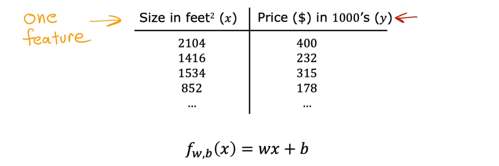

# Multiple linear regression

## Multiple features

- Review: Univariate Linear Regression

  

- Multiple Features & Notation

  

- Model of Multiple Linear Regression

  - **Multiple Linear Regression**: This is a type of linear regression that uses **multiple features**.

    - A model with **n features** can be represented as: fw,b(**x**) = w1**x1** + w2**x2** + ... + wn**xn** + b

  - Base Price: This refers to the starting price of a house, which is assumed to be $80,000, even if the house has no size, no bedrooms, no floors, and is not of any particular age.

  

  - (Note: The term "multivariate regression" refers to a different concept that we will not be using here.)

  

- Q:

  

- Next, we will discuss vectorization, which is necessary for implementing multiple linear regression.

## Vectorization part 1

## Vectorization part 2

## Optional lab: Python, NumPy and vectorization

## Gradient descent for multiple linear regression

## Optional Lab: Multiple linear regression
