# Gradient descent in practice

## Feature scaling part 1

- When a possible range of values of a feature is large, it's more likely that a good model will learn to choose a relatively small parameter value. Likewise, when the possible values of the feature are small, then a reasonable value for its parameters will be relatively large.

  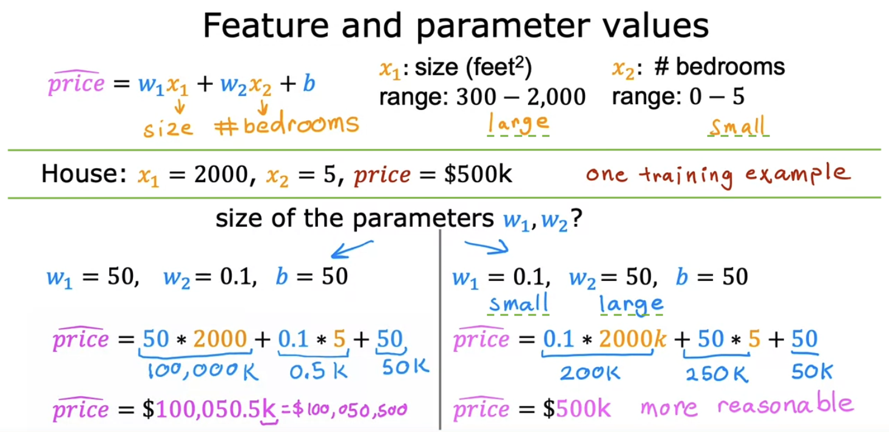

- A very small change to w1 can have a very large impact on the estimated price and that's a very large impact on the cost J. In contrast, it takes a much larger change in w2 in order to change the predictions much. And small changes to w2, don't change the cost function nearly as much.

  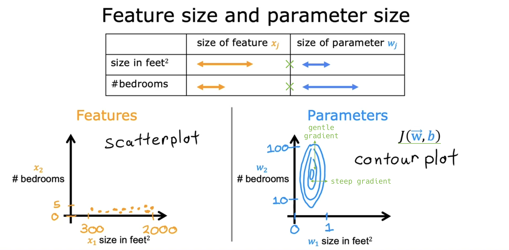

> [!IMPORTANT]
>
> The key points of this lecture are:
>
> When **features** have **different ranges** as in the top-left graph, the **cost function** becomes **skinny** as in the top-right graph, **slowing** the learning. In such cases, it's crucial to **scale features to comparable ranges** as in the bottom-left graph. This results in a **circular cost function** as in the bottom-right graph, **speeding up** the learning.
>
> 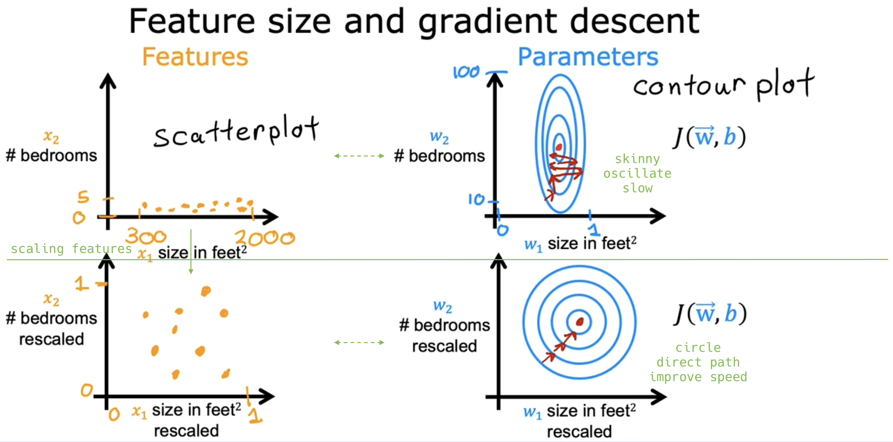

## Feature scaling part 2

- Three ways to implement feature scaling:

  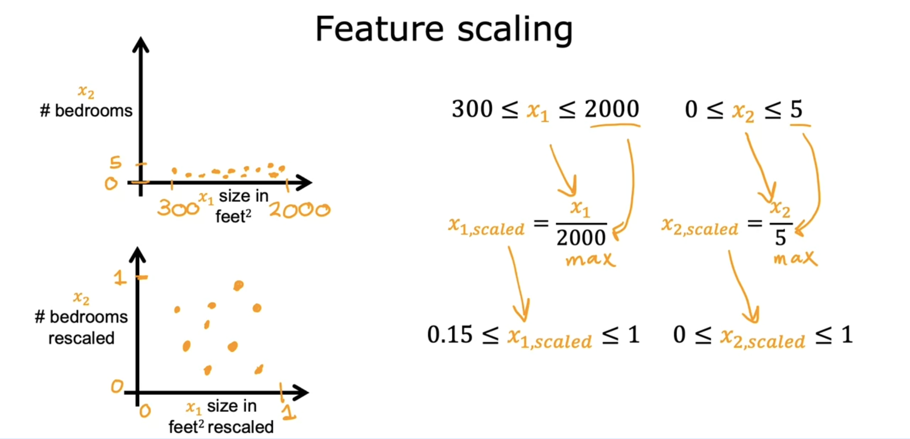

  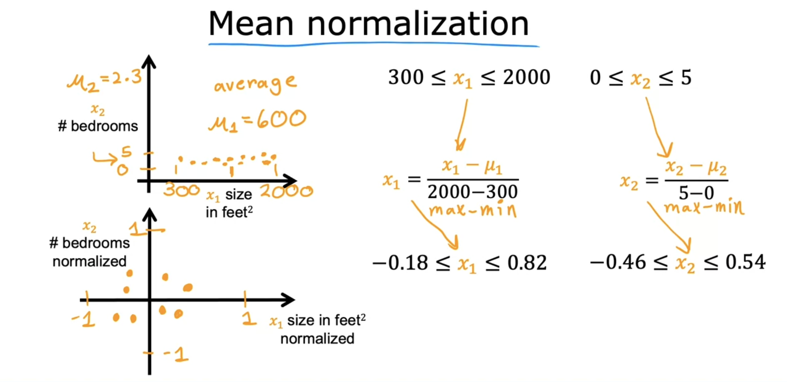

  

- Should you scale your features?

  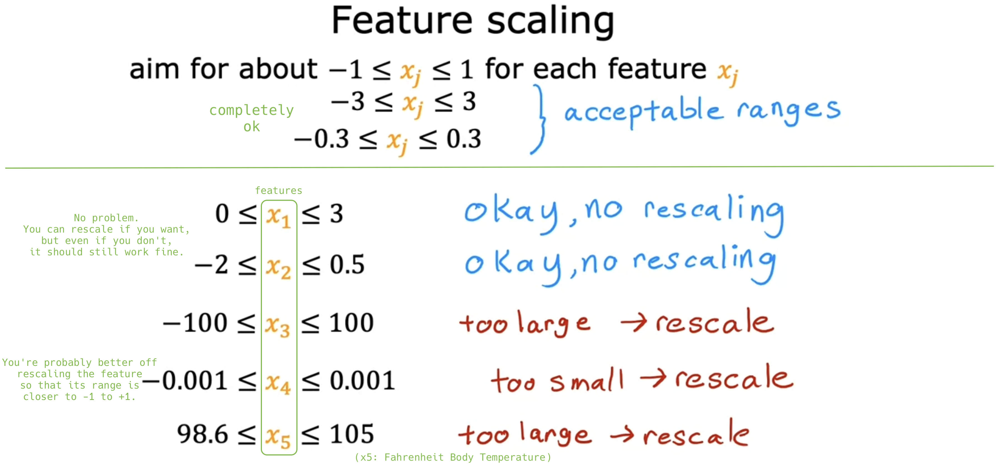

> [!IMPORTANT]
>
> There's almost never any harm to carrying out feature rescaling. When in doubt, I encourage you to just carry it out.

- Q:

  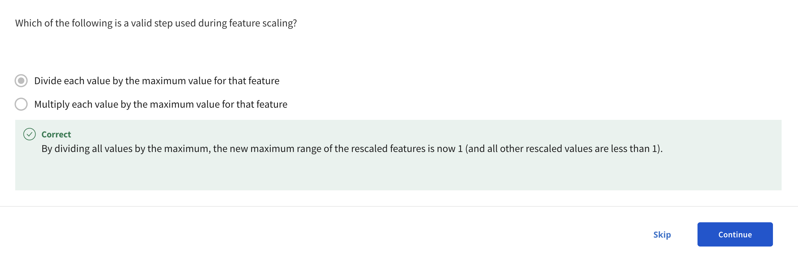

## Checking gradient descent for convergence

- Review: Gradient descent

  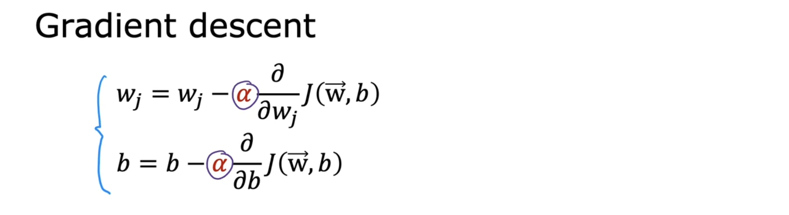

- Two methods to ensure gradient descent is working correctly:

  - [1] **Create a learning curve graph**. If gradient descent is functioning properly, the cost J should decrease with each iteration. If J increases, &alpha; may be **too large** or there might be a **bug** in the code.

    - Observing the graph can provide **early warnings** if gradient descent isn't functioning correctly.

  - [2] **Use an automatic convergence test**. However, setting the right threshold &epsilon; can be challenging, which is why **I prefer method [1]**.

  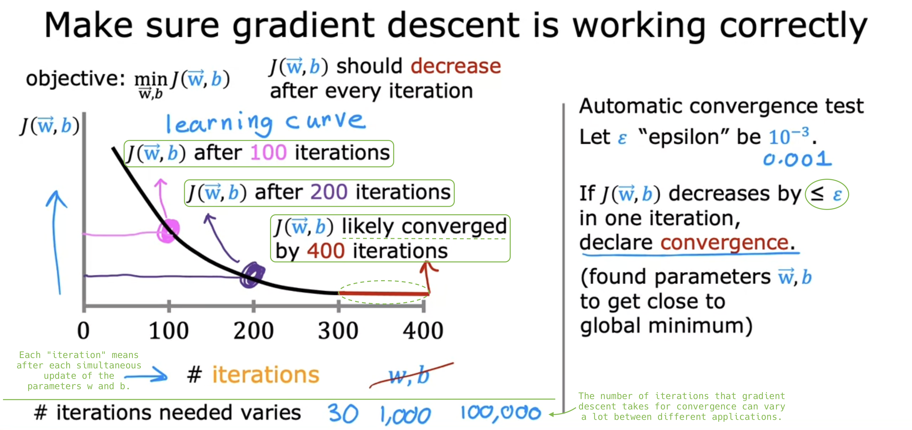

- Note: Various types of learning curves are used in machine learning, and more will be introduced later.

## Choosing the learning rate

- Your learning algorithm will run much **faster** with an appropriate choice of learning rate &alpha;.

- **Debugging** for the correct implementation of gradient descent:

  - If gradient descent isn't functioning properly, I often set &alpha; to a **very small number**. If cost J still increases, there's likely a **bug in the code**.

  - This very small &alpha; is **for debugging**, not for training the model, as it slows down convergence.

  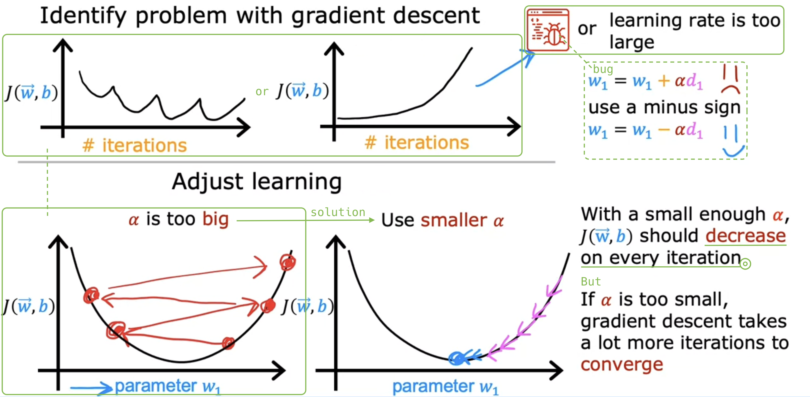

- Objective: Find &alpha; that **quickly** and **consistently** reduces cost J.

  - I run gradient descent just for a handful of iterations for each &alpha; (**0.001, 0.003, 0.01, ...**), plotting cost J against iterations. I continue until I find a too small and a too large learning rate &alpha;.

  - I then select **the largest reasonable &alpha;** or **slightly smaller** than it.

  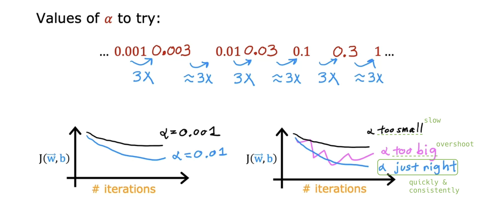

- Q:

  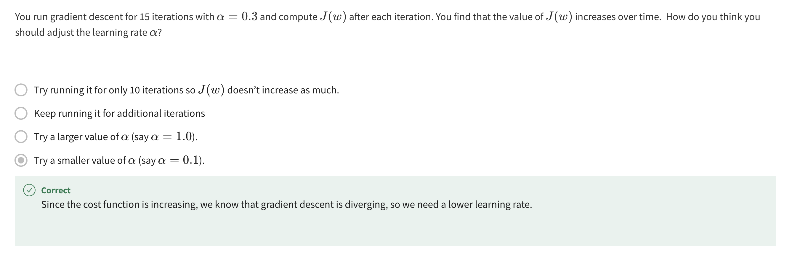

## Optional Lab: Feature scaling and learning rate

## Feature engineering

- **Feature engineering** is the process of using domain knowledge to create new features from existing ones, enhancing the model's predictive accuracy.

  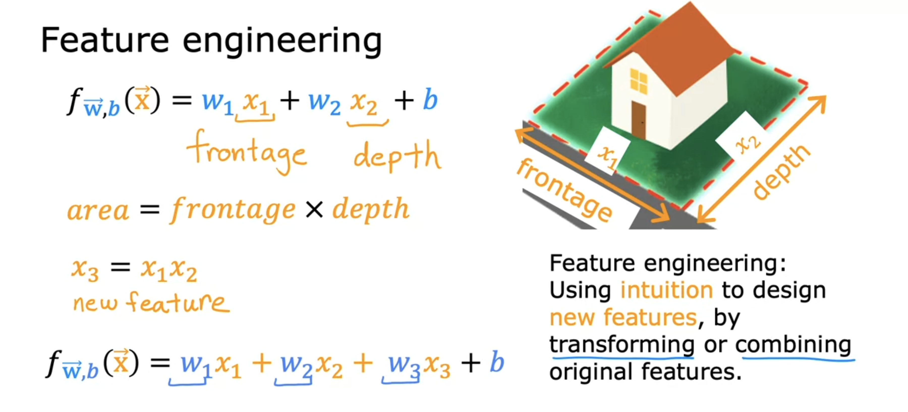

- Q:

  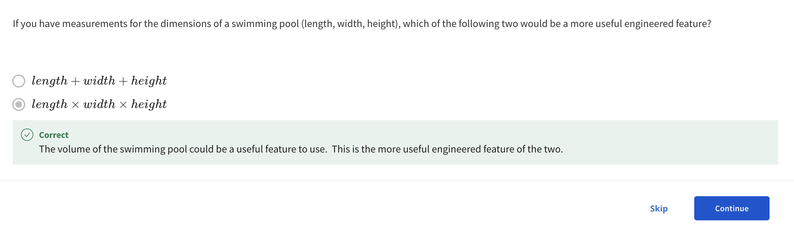

- Next: Feature engineering enables fitting curves or non-linear functions to data, not just straight lines.

## Polynomial regression

- a

  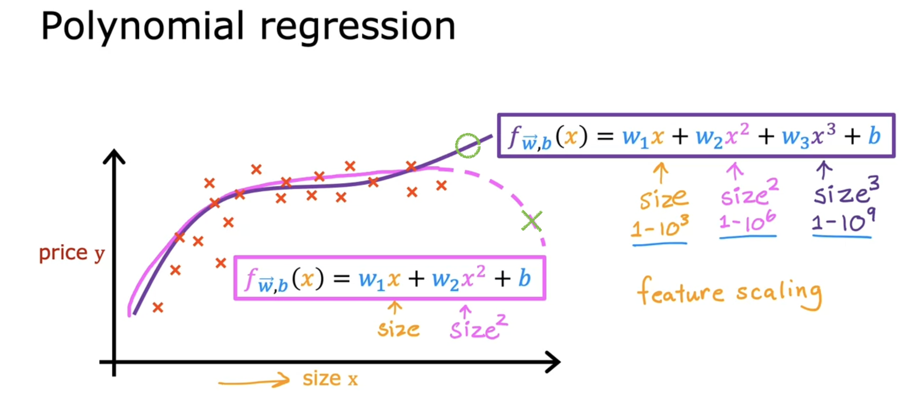

  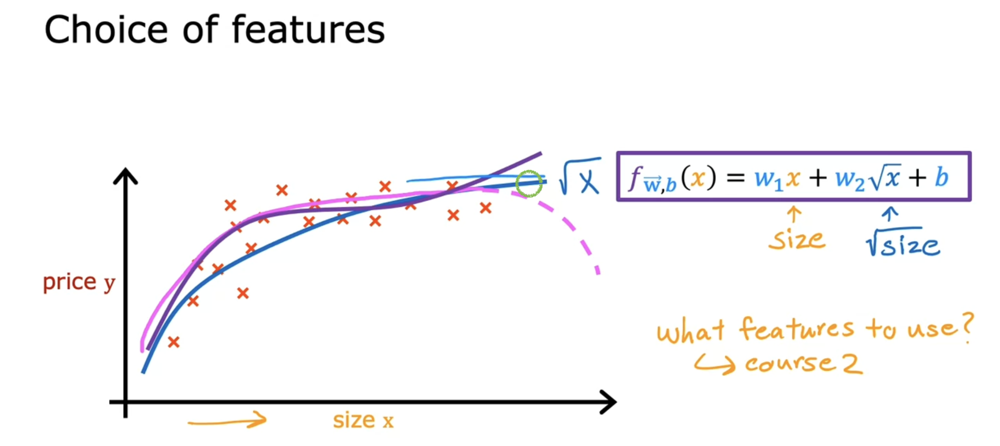

## Optional lab: Feature engineering and Polynomial regression

## Optional lab: Linear regression with scikit-learn
