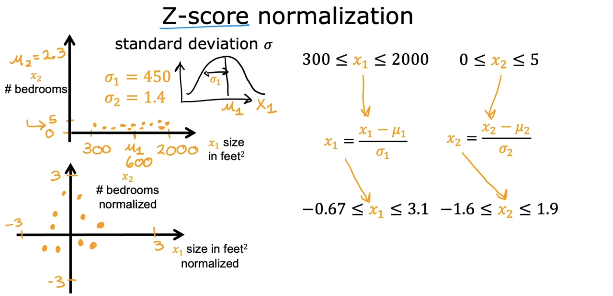

# Gradient descent in practice

## Feature scaling part 1

- When a possible range of values of a feature is large, it's more likely that a good model will learn to choose a relatively small parameter value. Likewise, when the possible values of the feature are small, then a reasonable value for its parameters will be relatively large.

  

- A very small change to w1 can have a very large impact on the estimated price and that's a very large impact on the cost J. In contrast, it takes a much larger change in w2 in order to change the predictions much. And small changes to w2, don't change the cost function nearly as much.

  

> [!IMPORTANT]
>
> The key points of this lecture are:
>
> When **features** have **different ranges** as in the top-left graph, the **cost function** becomes **skinny** as in the top-right graph, **slowing** the learning. In such cases, it's crucial to **scale features to comparable ranges** as in the bottom-left graph. This results in a **circular cost function** as in the bottom-right graph, **speeding up** the learning.
>
> 

## Feature scaling part 2

- a

  

  

  

  

- Q:

  

## Checking gradient descent for convergence

- a

  
  ｆ
  

## Choosing the learning rate

- a

  

  

- Q:

  

## Optional Lab: Feature scaling and learning rate

## Feature engineering

- a

  

- Q:

  

## Polynomial regression

- a

  

  

## Optional lab: Feature engineering and Polynomial regression

## Optional lab: Linear regression with scikit-learn
