# Classification with logistic regression

## Motivations

- The assignment of true/1 or false/0 is often arbitrary. Often either choice could work. (e.g. non-spam: true/1, spam: false/0)

  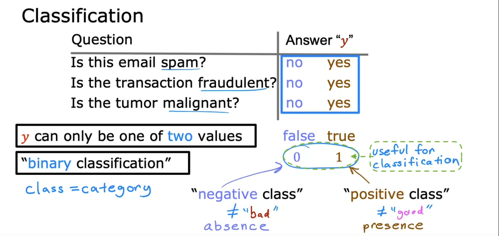

- What happens when you try to use linear regression for classification? - Often it will **not** work well.

  - For this particular training set, the blue line seems reasonable at first glance.
  - However, just by adding one training example to the right, the linear regression line (and decision boundary) shifts significantly to the right, resulting in a drastic decrease in prediction accuracy.

  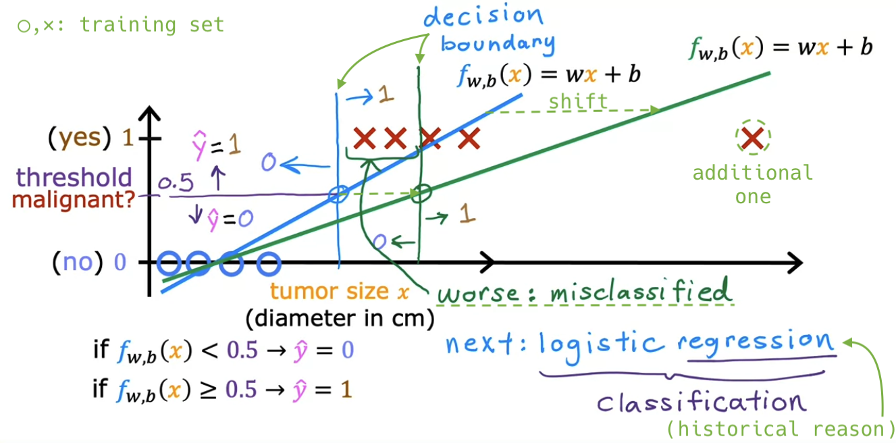

- Q:

  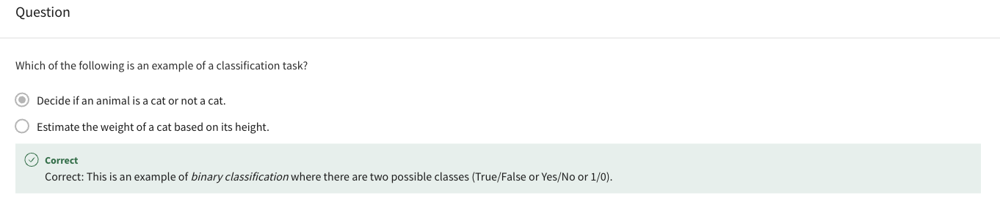

## Optional lab: Classification

## Logistic regression

- **Logistic regression** is probably the single most widely used classification algorithm in the world.

  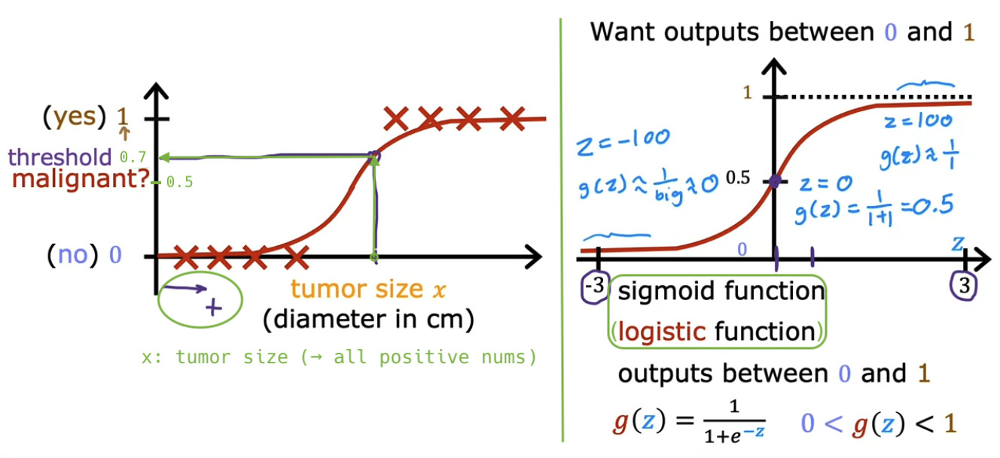

  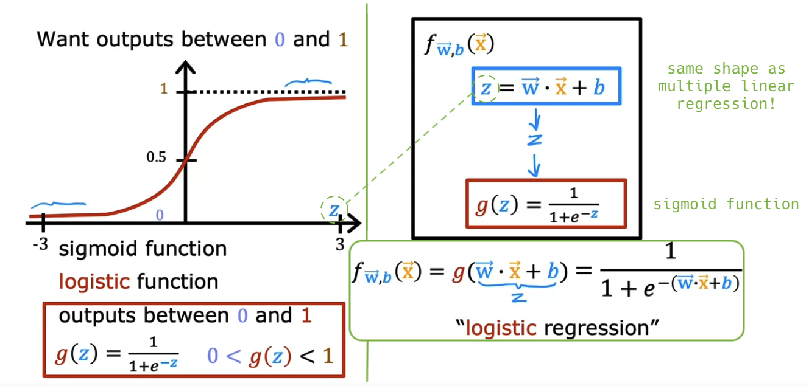

- Interpretation of logistic regression output: **Probability** of **y=1** on input x

  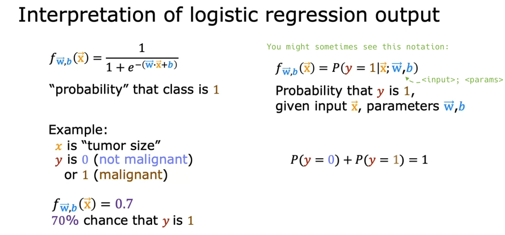

- Q:

  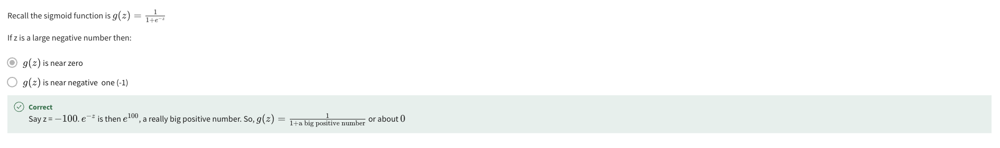

- For a long time, many internet ads operated on a slightly modified version of logistic regression.

> [!NOTE]
>
> Logistic regression: fw,b(x) = g(w&middot;x+b)
>
> - g(x) = 1 / (1 + e-x) &rarr; (same as sigmoid function)
>
> - g(2x) = 1 / (1 + e-2x) &rarr; shift x-axis by /2
>
> - g(x+2) = 1 / (1 + e-(x+2)) = g(x-(-2)) &rarr; shift x-axis by -2
>
> - g(2x+4) = 1 / (1 + e-(2x+4)) = g(2(x-(-2))) &rarr; shift x-axis by /2 and then -2
>
> - g(-0.5x+0.5) = 1 / (1 + e-(-0.5x+0.5)) = g(-0.5(x-1)) &rarr; shift x-axis by \*(-2) and then +1
>
> 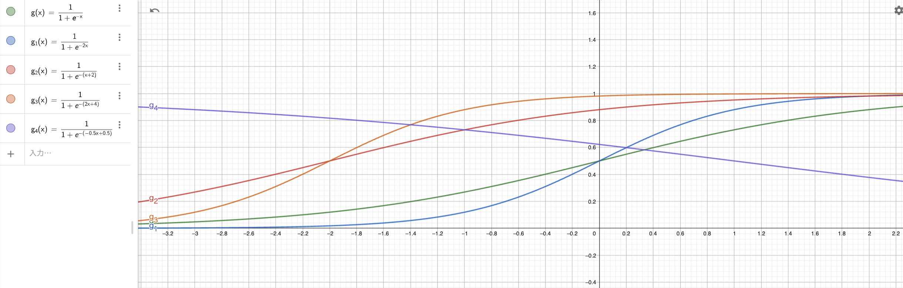
>
> cf. What are the values of x to obtain the same output value of 1?
>
> - h(x) = x2
>
>   - **x = 1**
>
> - h(2x) = (2x)2
>
>   - 2x = 1
>   - &therefore; x = **1** /2 = 0.5
>   - i.e. shift x-axis by /2
>
> - h(x+2) = (x+2)2 = h(x-(-2))
>
>   - x-(-2) = 1
>   - &therefore; x = **1** -2 = -1
>   - i.e. shift x-axis by -2
>
> - h(2x+4) = (2x+4)2 = h(2(x-(-2)))
>
>   - 2(x-(-2)) = 1
>   - x-(-2) = 1 /2
>   - &therefore; x = **1** /2 -2 = -1.5
>   - i.e. shift x-axis by /2 and then -2
>
> - h(-0.5x+0.5) = (-0.5x+0.5)2 = h(-0.5(x-1))
>
>   - -0.5(x-1) = 1
>   - x-1 = 1 /(-0.5)
>   - &therefore; x = **1** /(-0.5) +1 = **1** \*(-2) +1 = -1
>   - i.e. shift x-axis by \*(-2) and then +1
>
> 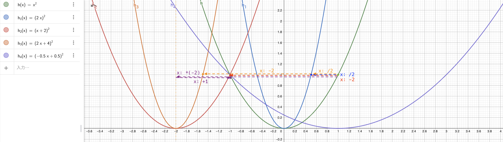

## Optional lab: Sigmoid function and logistic regression

## Decision boundary

- When does the prediction yield 1, and when does it yield 0?

  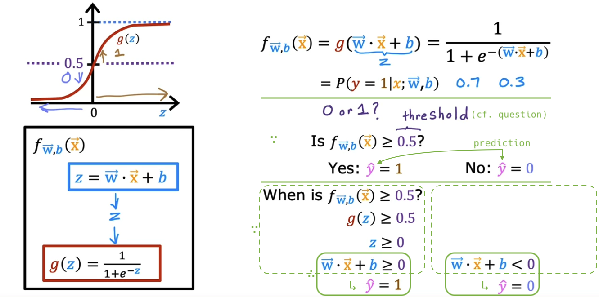

- **Decision boundary**: If the threshold is 0.5, the decision boundary is **z=0**.

  - For instance, if the parameters are w1=1, w2=1, b=-3, the decision boundary is the following purple line:

  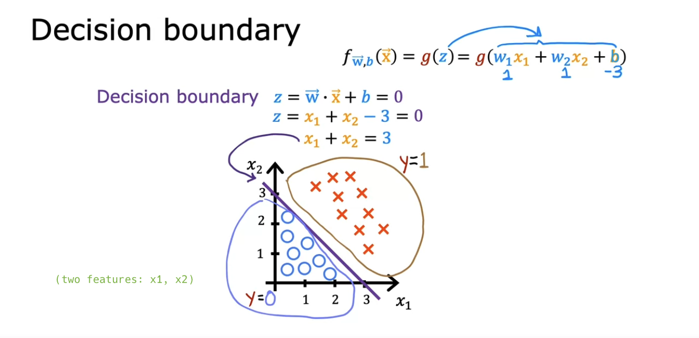

  - You can use **polynomial features** to get more **complex** decision boundaries.

  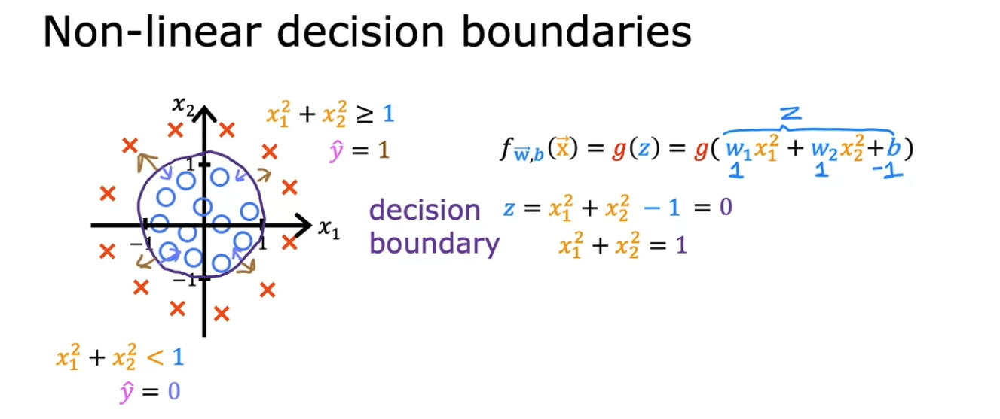

  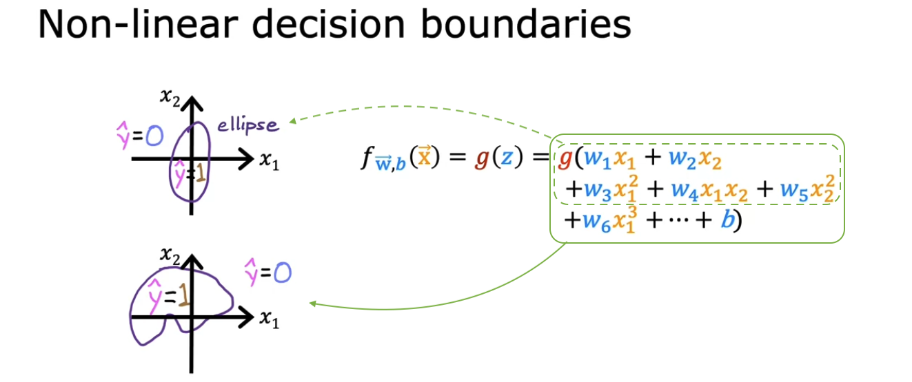

- Q:

  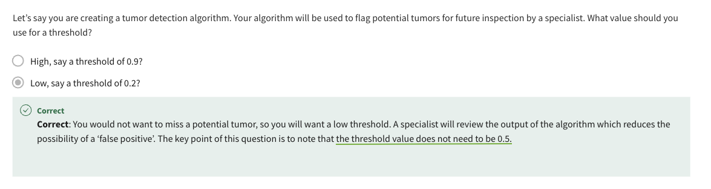

## Optional lab: Decision boundary
