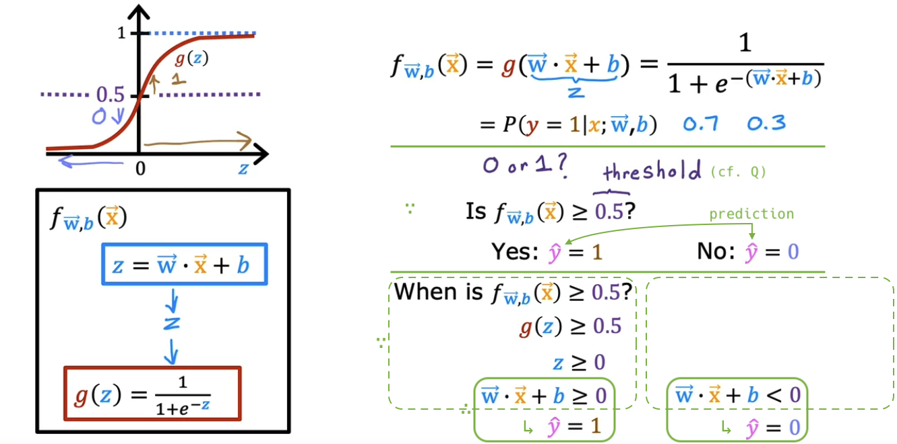

# Classification with logistic regression

## Motivations

- The assignment of true/1 or false/0 is often arbitrary. Often either choice could work. (e.g. non-spam: true/1, spam: false/0)

  

- What happens when you try to use linear regression for classification? - Often it will **not** work well.

  - For this particular training set, the blue line seems reasonable at first glance.
  - However, just by adding one training example to the right, the linear regression line (and decision boundary) shifts significantly to the right, resulting in a drastic decrease in prediction accuracy.

  

- Q:

  

## Optional lab: Classification

## Logistic regression

- **Logistic regression** is probably the single most widely used classification algorithm in the world.

  

  

- Interpretation of logistic regression output: **Probability** of **y=1** on input x

  

- Q:

  

- For a long time, many internet ads operated on a slightly modified version of logistic regression.

> [!NOTE]
>
> g(z) = 1 / (1 + e-z)
>
> g(z+4) = 1 / (1 + e-(z+4)) = g(z-(-4))
>
> g(2z+8) = 1 / (1 + e-(2z+8)) = g(2(z-(-4)))
>
> g(-0.5z+1) = 1 / (1 + e-(-0.5z+1)) = g(-0.5(z-2))
>
> 

## Optional lab: Sigmoid function and logistic regression

## Decision boundary

- When does the prediction yield 1, and when does it yield 0?

  

- **Decision boundary**: If the threshold is 0.5, the decision boundary is **z=0**.

  - For instance, if the parameters are w1=1, w2=1, b=-3, the decision boundary is the following purple line:

  

  - You can use **polynomial features** to get more **complex** decision boundaries.

  

  

- Q:

  

## Optional lab: Decision boundary
