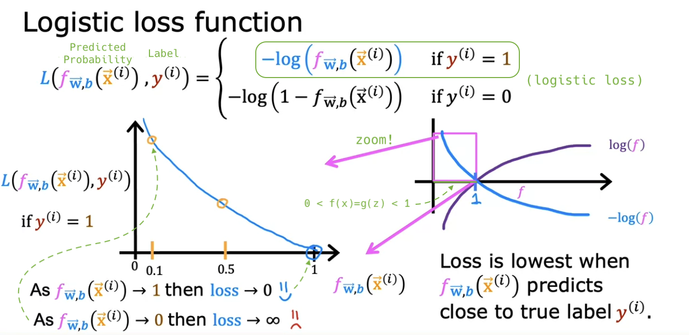

# Cost function for logistic regression

## Cost function for logistic regression

- Notation:

  

- Squared error cost doesn't work well for logistic regression.

  - The **cost function** is obtained by taking the average of the **loss function** on each training example.
  - And, the cost function represents how well specific parameters fits the entire training set.

  

- By using **logistic loss** function for logistic regression, we can make it's cost function convex.

  - Note: f is always between 0 and 1 because [the output of logistic regression is always between 0 and 1](https://github.com/shisotem/stanford-andrew-ng-ml-dl/blob/main/s1_machine_learning_specialization/c1_supervised_machine_learning_regression_and_classification/w3_classification/01_classification_with_logistic_regression/resources/notes/04.png).

  - Parameters that make predictions close to 0 for the training example with a label of 1 will incur a large loss.

  

  

- By using **logistic loss** function for logistic regression, we can make it's cost function convex.

  

- Q:

  

## Optional lab: Logistic loss

## Simplified Cost Function for Logistic Regression

## Optional lab: Cost function for logistic regression
