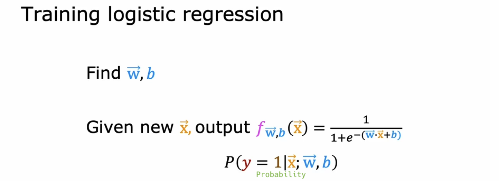
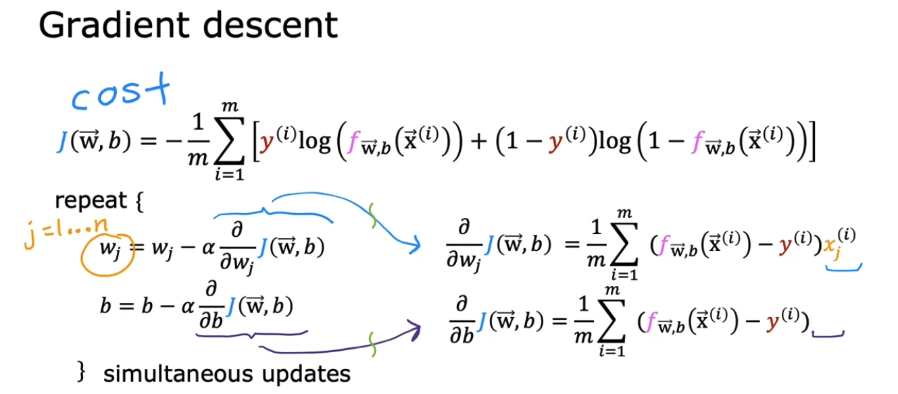
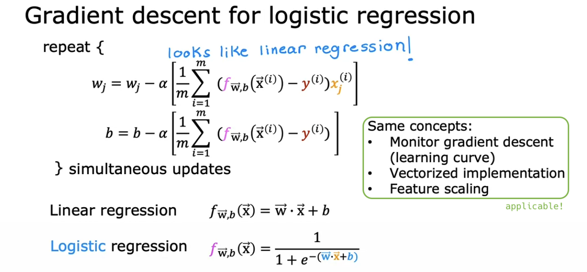

# Gradient descent for logistic regression

## Gradient Descent Implementation

- (I want to find the optimal parameters to enable outputting prediction probabilities for new data.)

  

- When we take the partial derivative (derivation omitted), it's exactly the same form as [linear regression](https://github.com/shisotem/stanford-andrew-ng-ml-dl/tree/main/s1_machine_learning_specialization/c1_supervised_machine_learning_regression_and_classification/w2_regression_with_multiple_input_variables/01_multiple_linear_regression#gradient-descent-for-multiple-linear-regression)!!?

  

- However, because the contents of f(x) are different, it's actually a different gradient descent algorithm.

  

## Optional lab: Gradient descent for logistic regression

## Optional lab: Logistic regression with scikit-learn
