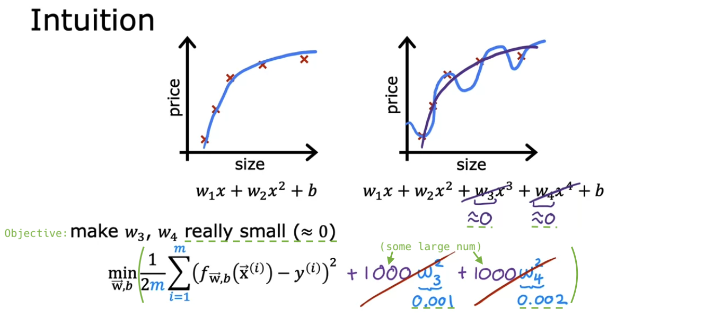

# The problem of overfitting

## The problem of overfitting

- **Underfit** = **High bias** ↔ Just right &#9834; = Generalization ↔ **Overfit** = **High variance**

  - Underfitting: Caused by high bias (**preconception**), like assuming data is linear.

  - **Generalization**: Ability to predict accurately on unseen examples.

  - Overfitting: Occurs with **high-order polynomials** with **many features**.

    - Parameters make cost function zero (error is zero for all training examples).

    - **Works well on training set, but not on new examples**.

    - Slight changes in training set drastically alter the applied function.

  

  

- Q:

  

## Addressing overfitting

- We'll now learn to **address** overfitting. (Later in this specialization, we'll learn to **diagnose** it and underfitting.)

- If **more training data** is available, fitting a high order polynomial or feature-rich function can continue.

  - **This is ideal, if feasible**.

  

- **Feature selection**: Picking optimal features.

  - Reducing features, i.e., setting parameter wj to zero.

  - e.g.

    - [w1x + w2x2 + w3x3 + w4x4 + b &rarr; w1x + w2x2 + b](https://github.com/shisotem/stanford-andrew-ng-ml-dl/blob/main/s1_machine_learning_specialization/c1_supervised_machine_learning_regression_and_classification/w3_classification/07_the_problem_of_overfitting/resources/notes/01.png)
    - w1x1 + w2x2 + ... + w100x100 + b &rarr; w1x1 + w2x2 + w4x4 + b

  - Drawback: May lose useful prediction info.

  - (Algorithms for automatic feature selection come later in Course 2.)

  

- **Regularization**: Gently reduces some features' influence to prevent overfitting, without eliminating them.

  - Tips: Regularizing b is optional, but it makes little difference. **I usually don't**. Regularizing w1 to wn is enough.

  - (Applicable to neural networks.)

  

- Just for myself, **I use regularization all the time**.

  

- Q:

  

## Optional lab: Overfitting

## Cost function with regularization

- Introduce a **regularization term** to the cost function.

  - To minimize the modified cost function, we need to bring w3, w4 close to 0.

  - Eventually, the influence of features x3, x4 becomes almost negligible, and we obtain an almost quadratic function.

  

- Generally, there are more features, and it's difficult to choose which feature's influence to diminish.

  - Therefore, create a model that **includes all features** and **regularize all parameters wj**.

- The **regularization parameter &lambda;** needs to be appropriately chosen, just like the learning rate &alpha;.

  - By scaling the first and second terms in the **same way** (/2m), it becomes a bit easier to choose a good value for λ.

  - With /2m, even if the training set becomes larger, there is a high possibility that the previously chosen value of λ will continue to work well.

  

- Two **trade-off** objectives:

  - **First term**: We want parameters that fit the training data.

  - **Second term**: We want to reduce overfitting by keeping parameters small.

- The choice of &lambda; specifies **how to balance** between these two objectives.

  - (Extreme examples: &lambda; = 0, 1010)

  - We want to choose just the right value for &lambda;.

  

- Q:

  

## Regularized linear regression

- a

- Q:

## Regularized logistic regression

- a

- Q:

## Optional lab: Regularization
