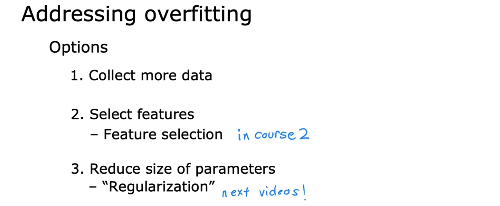

# The problem of overfitting

## The problem of overfitting

- **Underfit** = **High bias** ↔ Just right = Generalization ↔ **Overfit** = **High variance**

  - Underfitting: Caused by **preconception** or strong bias, like assuming data is linear.

  - **Generalization**: Ability to predict accurately on unseen examples.

  - Overfitting: Occurs with **high-order polynomials** with **many features**.

    - Parameters make cost function zero (error is zero for all training examples).

    - **Works well on training set, but not on new examples**.

    - Slight changes in training set drastically alter the applied function.

  

  

- Q:

  

## Addressing overfitting

- a

  

  

  

  

- Q:

  

## Optional lab: Overfitting

## Cost function with regularization

- a

- Q:

## Regularized linear regression

- a

- Q:

## Regularized logistic regression

- a

- Q:

## Optional lab: Regularization
