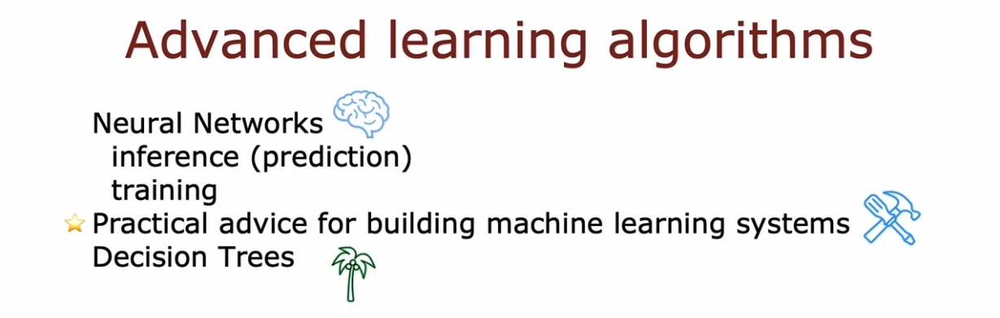
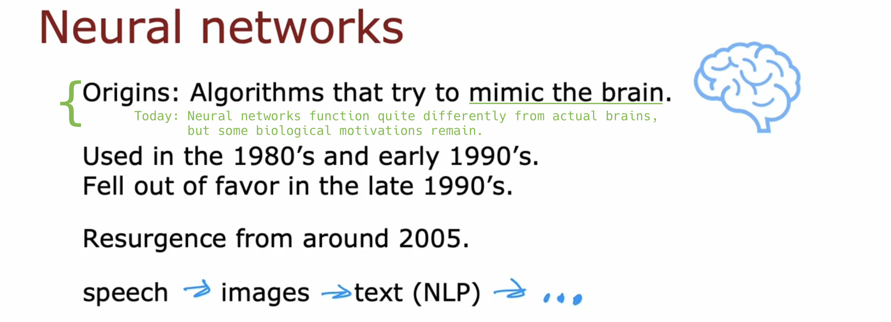
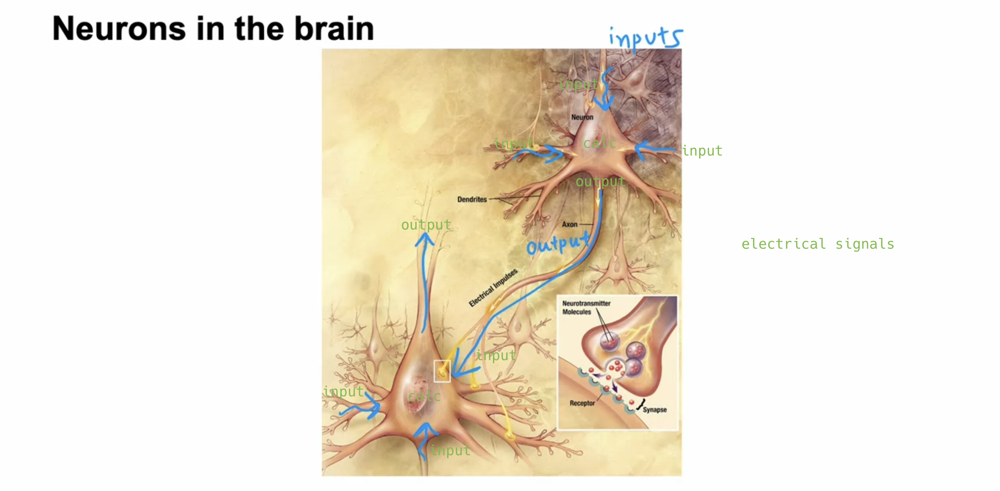
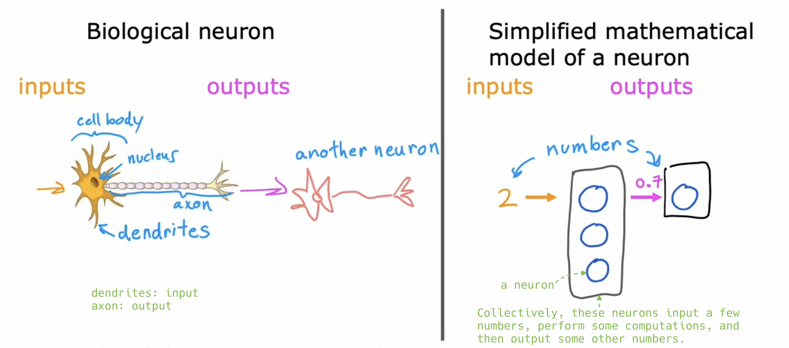
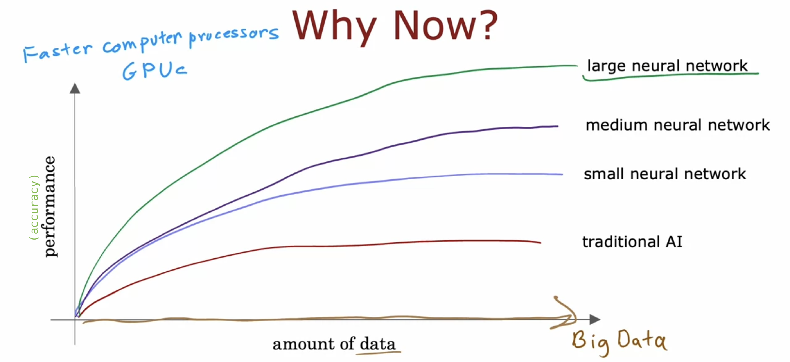
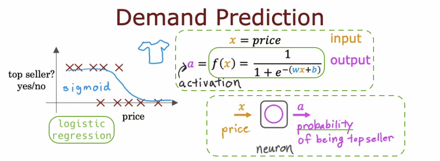

# Neural networks intuition

## Welcome!

- Contents of this course:

  - **Inference** refers to the process of downloading **pre-trained parameters** and using them to make predictions.

  

## Neurons and the brain

- History of **Neural Networks**:

  - 1950's: 🚀
  - ~: ❄️
  - 1980's and early 1990's: 😎 (Handwritten Digit Recognition)
  - late 1990's ~: ❄️
  - 2005 ~: 😎 (Rebranded with Deep Learning)
    - Speech Recognition
    - &rarr; Computer Vision cf. ImageNet(2012)
    - &rarr; Text (NLP)
  - Today: Climate Change, Medical Imaging, Online Advertising etc.

  

- The mechanism of human thinking:

  

- Simplified mathematical model of a neuron:

  

- Why are neural networks popular now?

  - The **explosion of digital data** (due to the advent of the internet, increased digitalization of society, etc.)

    - Traditional AI methods (e.g., linear regression, logistic regression) don't improve significantly with more data.
    - Large neural networks, on the other hand, can continually improve performance with more data in certain applications.

  - The advent of **GPU**s, which are powerful tools for deep learning, has also played a crucial role.

  

## Demand Prediction

- Will this product be a top seller or not? (&rarr; inventory levels, marketing campaigns)

- a = f(x)

  - a: "**Activation**" is actually a term from neuroscience, indicating how much high output a neuron is sending to other downstream neurons that follow it.

  - f(x): A neuron's **activation function**, which can be a **sigmoid function**, a ReLU function, among others.

    - This small logistic regression algorithm is, in fact, a very simplified model of a single neuron in the brain.

## Example: Recognizing Images
