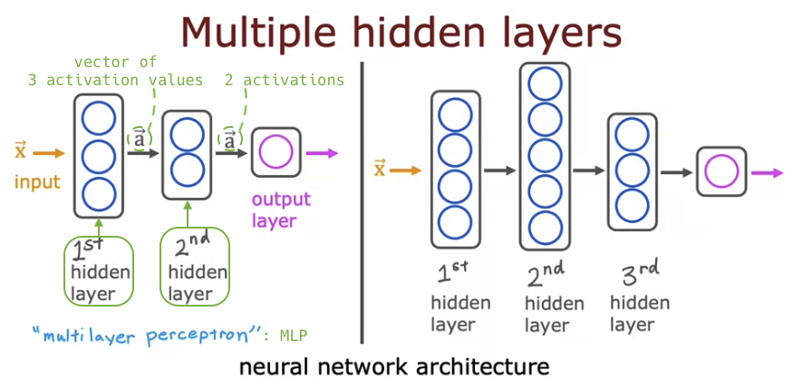

# Neural networks intuition

## Welcome!

- Contents of this course:

  - **Inference** refers to the process of using **pre-trained parameters** to make predictions on new data.

  

## Neurons and the brain

- History of **Neural Networks**:

  - 1950's: 🚀
  - ~: ❄️
  - 1980's and early 1990's: 😎 (Handwritten Digit Recognition)
  - late 1990's ~: ❄️
  - 2005 ~: 😎 (Rebranded with Deep Learning)
    - Speech Recognition
    - &rarr; Computer Vision cf. ImageNet(2012)
    - &rarr; Text (NLP)
  - Today: Climate Change, Medical Imaging, Online Advertising etc.

  

- The mechanism of human thinking:

  

- Simplified mathematical model of a neuron:

  

- Why are neural networks popular now?

  - The **explosion of digital data** (due to the advent of the internet, increased digitalization of society, etc.)

    - Traditional AI methods (e.g., linear regression, logistic regression) don't improve significantly with more data.
    - Large neural networks, on the other hand, can continually improve performance with more data in certain applications.

  - The advent of **GPU**s, which are powerful tools for deep learning, has also played a crucial role.

  

## Demand Prediction

- Will this product be a top seller or not? (&rarr; inventory levels, marketing campaigns)

- a = f(x):

  - a: "**activation**" is actually a term from neuroscience, indicating **how much high output a neuron is sending to other downstream neurons** that follow it.

  - f(x): A neuron's **activation function**, which can be a **sigmoid function**, a ReLU function, among others.

    - This logistic regression unit or little logistic regression algorithm is, in fact, a very simplified model of a single neuron in the brain.

  

- (&darr; Towards more complex Demand Prediction using NN &darr;)

- To build a neural network, we take a bunch of artificial neurons as we just saw and wire them together.

  - Here, an artificial neuron or a logistic regression unit takes inputs such as price and shipping cost to output the probability of people considering the item as affordable.

  - People often perceive expensive items as high quality.

- Term: A "**layer**" is a grouping of one or some neurons which inputs some features, and outputs a few numbers.

  - In this figure: **input layer**, (single) **hidden layer**, **output layer**

- The numbers of affordability, awareness, and perceived quality are the "activations" of the three neurons in the hidden layer, and the final output probability is **also** the "activation" of the neuron in the output layer.

  

- Simplification:

  - When building a large-scale neural network, it's **too hard** to **manually determine** which neuron receives which features as input.

  - In actual neural networks, a neuron is implemented to have access to **every value** of the previous layer.

    - Then, if predicting affordability, maybe set the parameters to **ignore** marketing and material, **focusing on relevant features** like price and shipping cost.

  

- Notation by vectors (simplification):

  - Tips: Why named "hidden" layer? - The **correct** values for affordability, awareness, and perceived quality are "hidden" (unknown).

  

- Another perspective on NN (for your intuition):

  - **Just a logistic regression** that inputs affordability, awareness, and perceived quality, and outputs the probability you are ultimately seeking.

  - Using a new set of features (affordability etc.), not the original features (price etc.) is why this "logistic regression" (NN) has higher prediction accuracy.

  

- Instead of manually engineering features as we did before, **NN automatically generates superior features**. This is why NN is one of the most powerful learning algorithms today.

- So far, we've described the neural network as calculating affordability, awareness, perceived quality. But in reality, humans needn't devise these features (affordability etc.). **The network determines the features to use in hidden layers by itself**, a notable characteristic of neural networks.

  

- **Neural network architecture**: How many **hidden layers**? & How many **neurons** per hidden layer? (&rarr; later in this course)

  

## Example: Recognizing Images
