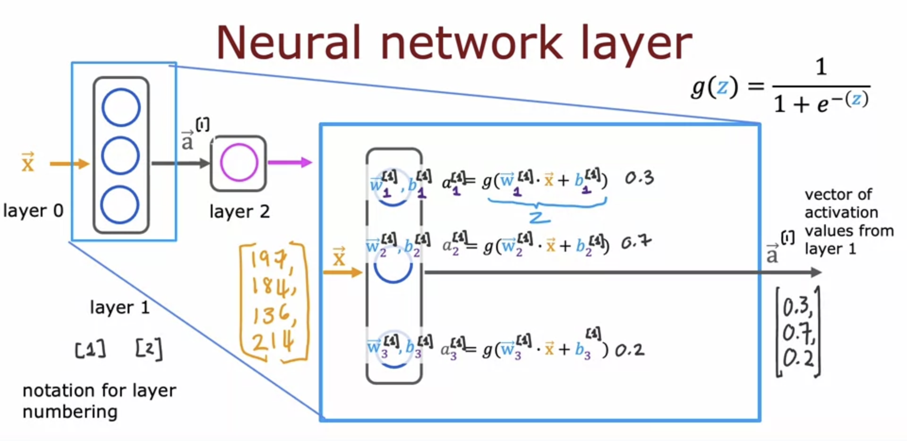
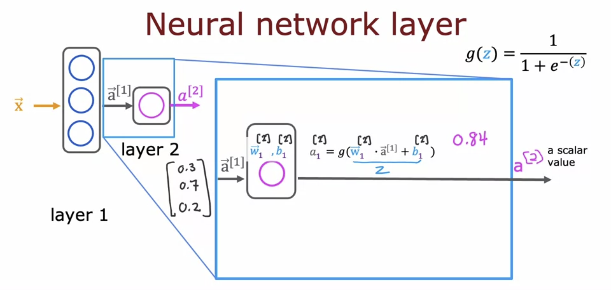
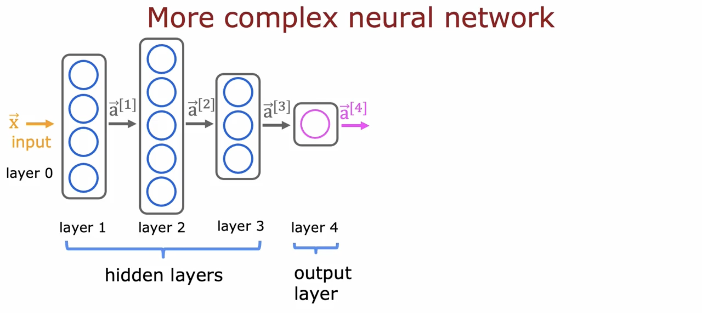
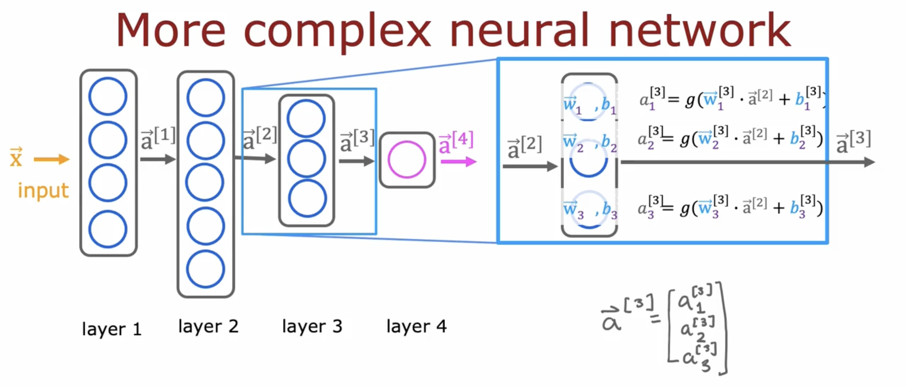
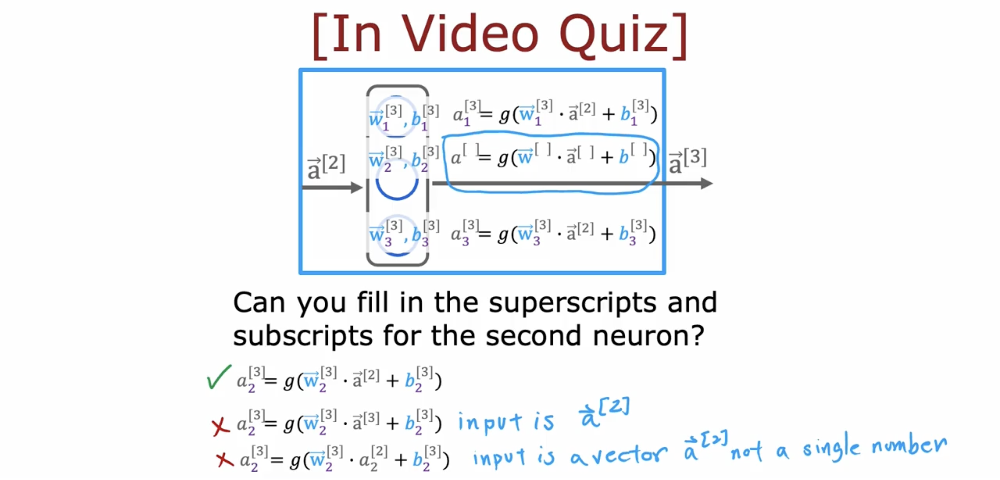
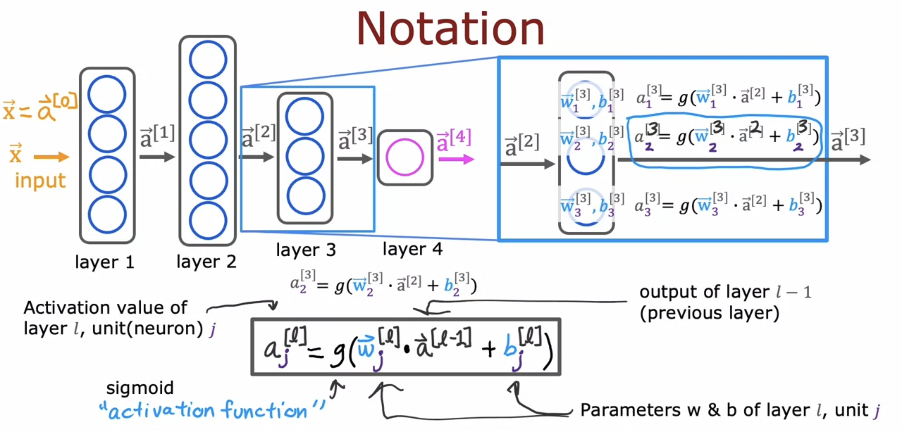
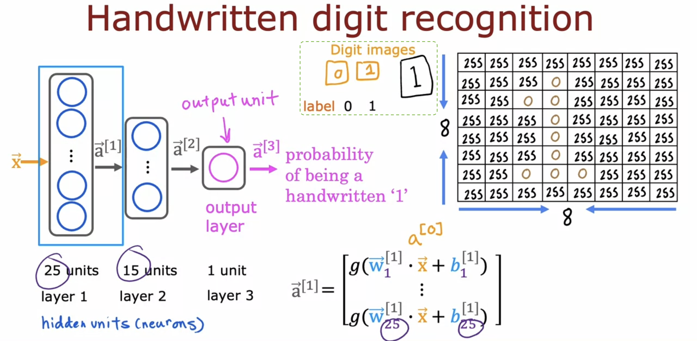
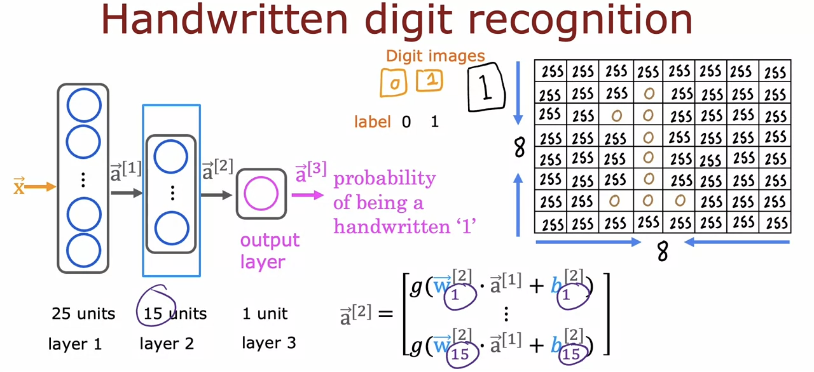
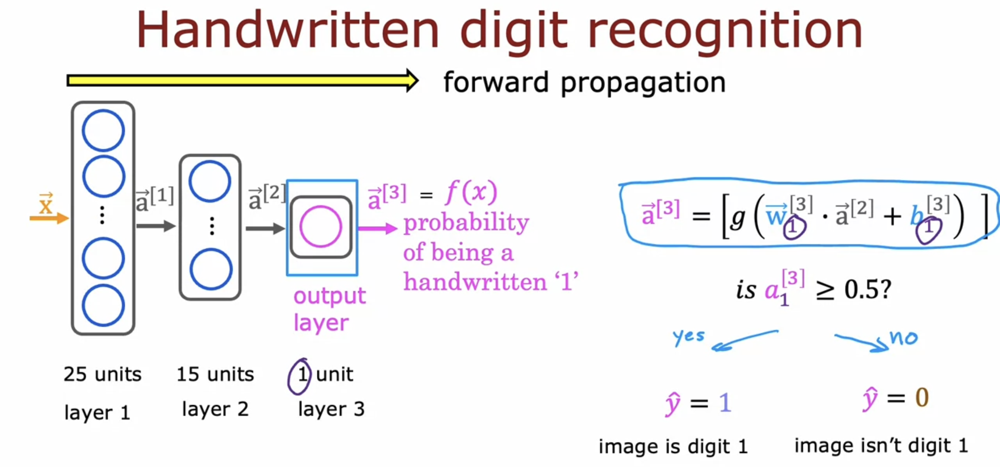

# Neural network model

## Neural network layer

- How to construct a "layer" of neurons:

  - These four numbers are inputs to **each** of three neurons.

  - There's a 0.3 chance of this being highly affordable based on the input features.

  - Remember whenever you see "**[1]**", that just refers to a quantity that is **associated with layer 1** of the neural network.

    - e.g. **w**2[1], b2[1] are the parameters of the second hidden unit or the second hidden neuron in layer 1.

  

- In this example, because the **output layer has just a single neuron**, the **output is a scalar**, which is a single number rather than a vector of numbers.

  

- Optional final step: Is this a top seller? (Yes/No, not probability)

  

## More complex neural networks

- By convention, when we say a neural network has four layers, this includes all the hidden layers and the output layer, but not the input layer.

  

- Reconfirm:

  

  

- General equation:

  

## Inference: making predictions (forward propagation)

- This is just a binary classification problem where we input an image and classify it as either the digit zero or one.

  

  

- You can also write the output of the neural network as **f(x)**.

  - Remember that we use f(x) to denote the output of linear regression and logistic regression.

- This is neural network **inference** via **forward propagation**.

  - It propagates neuron activations from left to right.

  - It is in contrast to the **learning algorithm**, **back propagation**.

  - (With this, you can download parameters from an online pre-trained neural network and make inferences on your new data.)

- This is a neural network architecture, which starts with more hidden units that decrease towards the output layer. There's also a pretty typical choice when choosing neural network architectures. (&rarr; more examples in the lab)

  

## Neurons and Layers
