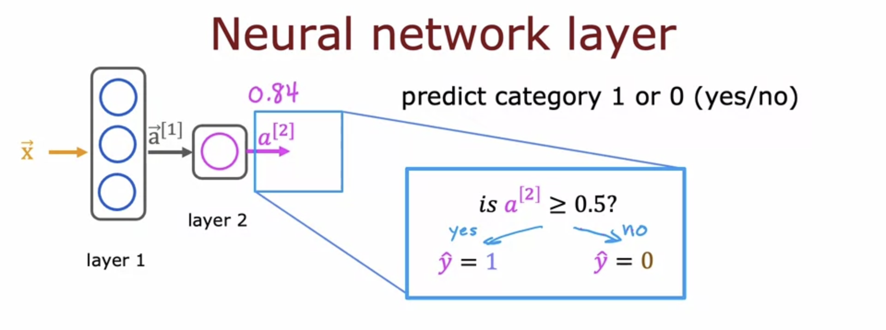

# Neural network model

## Neural network layer

- How to construct a "layer" of neurons:

  - These four numbers are inputs to **each** of three neurons.

  - There's a 0.3 chance of this being highly affordable based on the input features.

  - Remember whenever you see "**[1]**", that just refers to a quantity that is **associated with layer 1** of the neural network.

    - e.g. **w**2[1], b2[1] are the parameters of the second hidden unit or the second hidden neuron in layer 1.

  

- In this example, because the **output layer has just a single neuron**, the **output is a scalar**, which is a single number rather than a vector of numbers.

  

- Optional final step: Is this a top seller? (Yes/No, not probability)

  

## More complex neural networks

- By convention, when we say a neural network has four layers, this includes all the hidden layers and the output layer, but not the input layer.

  

- Reconfirm:

  

  

- General equation:

  

## Inference: making predictions (forward propagation)

## Neurons and Layers
