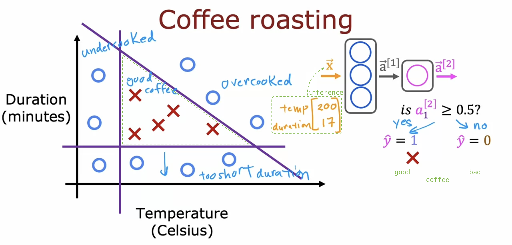
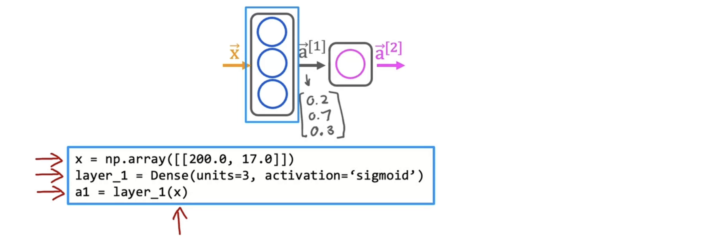
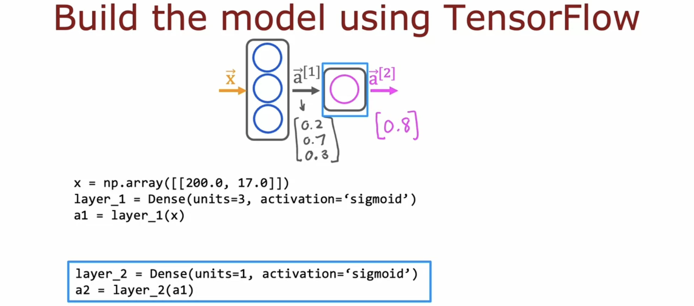
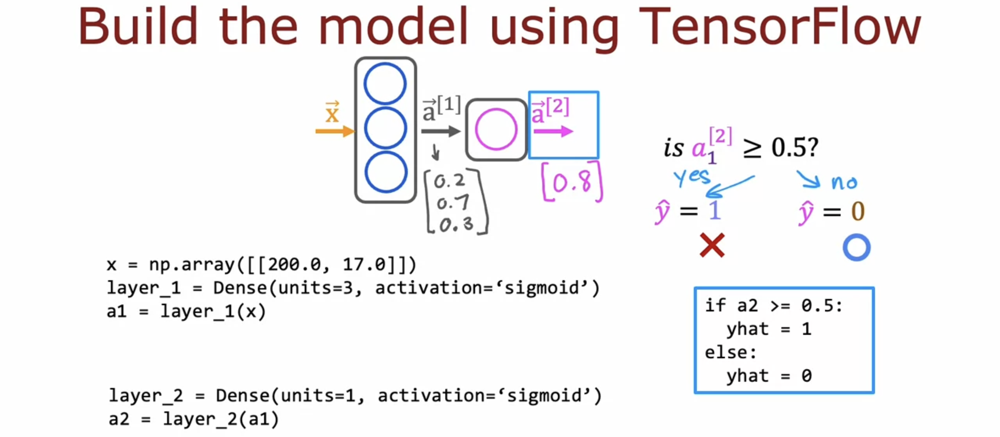
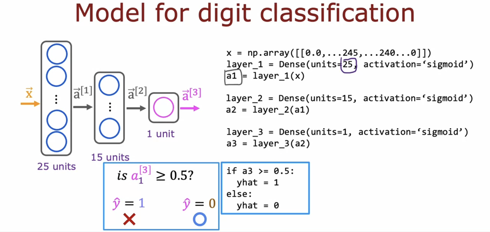
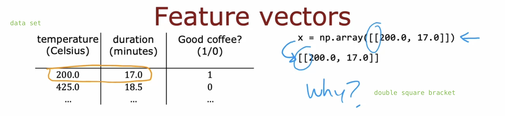

# TensorFlow implementation

## Inference in Code

- **TensorFlow** is one of the leading frameworks for implementing **deep learning** algorithms. (**PyTorch** is another one.)

- One of the remarkable things about **neural networks** is the **same algorithm** can be applied to so many **different applications**.

  

- The syntax for carrying out **inference** in TensorFlow:

  - "Dense" refers to a type of layer in the neural networks we've studied so far.

    - You'll learn about other types of layers later on.
    - For now, we'll stick with the **dense layer**.

  

  

  

- One more example:

  

- There are further details, like **loading the TensorFlow library and neural network parameters w and b**, not covered here. We'll address these in the lab, so please be sure to take a look.

## Data in TensorFlow

- How data is represented in NumPy and in TensorFlow:

  - NumPy was developed much earlier than TensorFlow.

  - Unfortunately, there are some inconsistencies between how data is represented in NumPy and in TensorFlow.

  

## Building a neural network

## Coffee Roasting in Tensorflow
