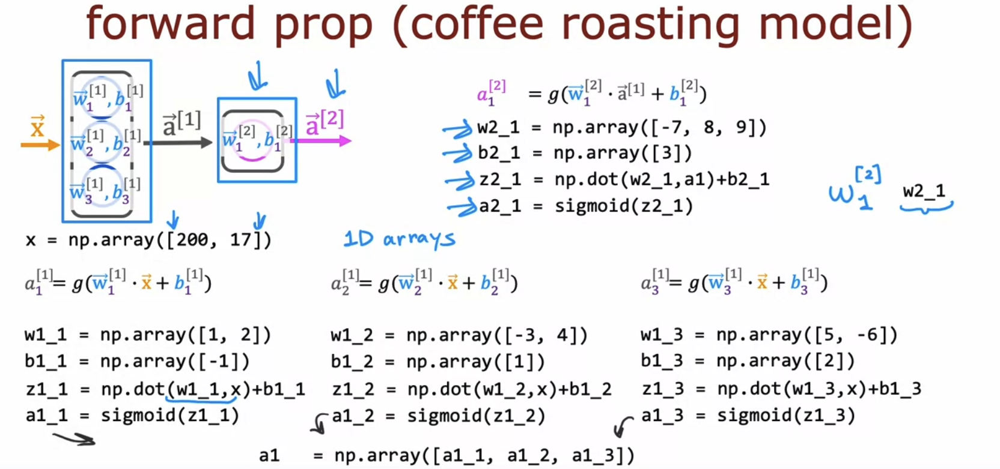
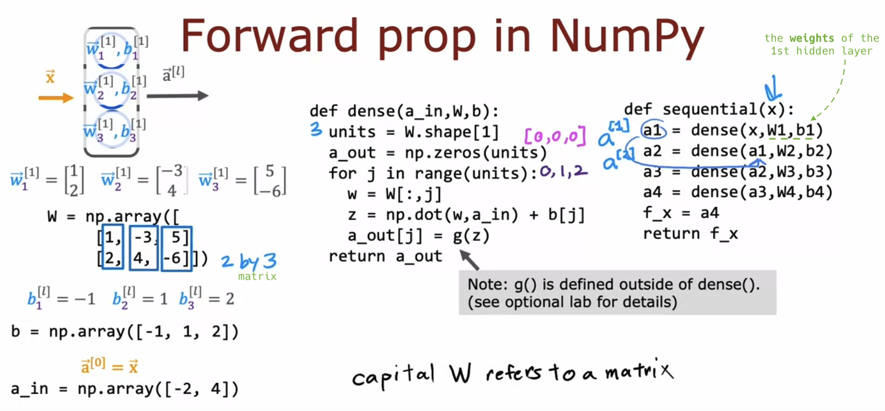

# Neural network implementation in Python

## Forward prop in a single layer

- Implementation of forward propagation:

  

## General implementation of forward propagation

- **Understanding** how libraries like TensorFlow work **internally** is important. It enhances your **debugging effectiveness** when facing slow performance, strange results, or potential bugs.

  - W1, b1 are called the parameters or **weights** of the first hidden layer.

  - In linear algebra, **uppercase** alphabets are used to represent **matrices**, and **lowercase** alphabets are used to represent **scalars or vectors**.

  

## CoffeeRoastingNumPy
