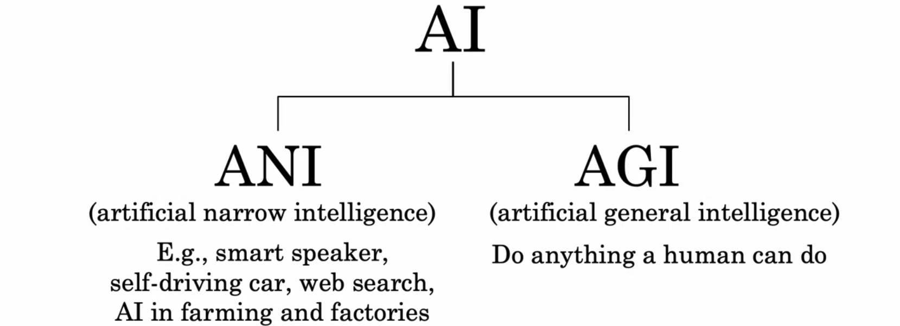
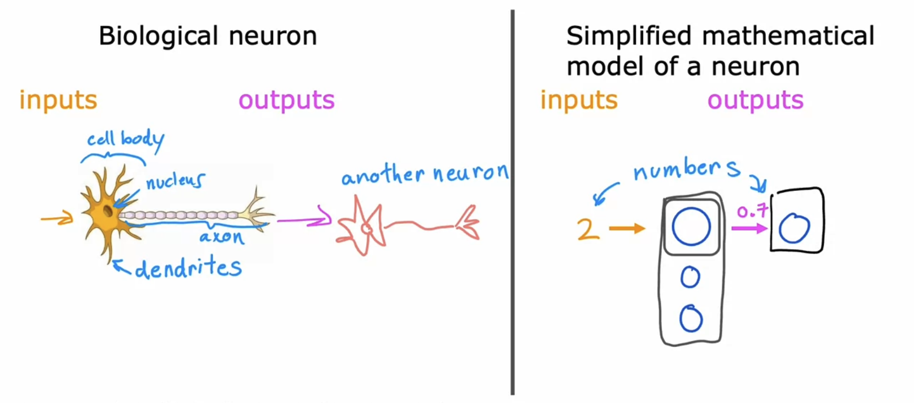
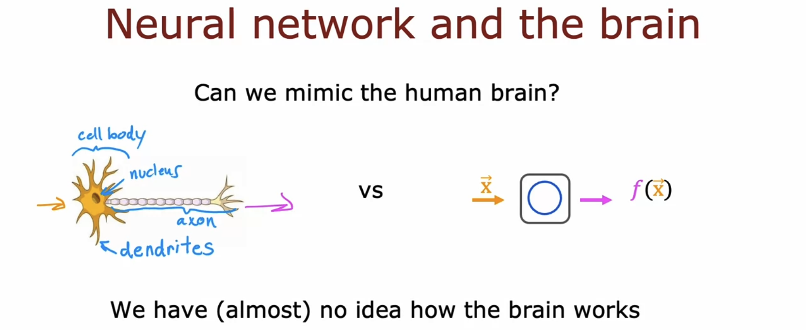
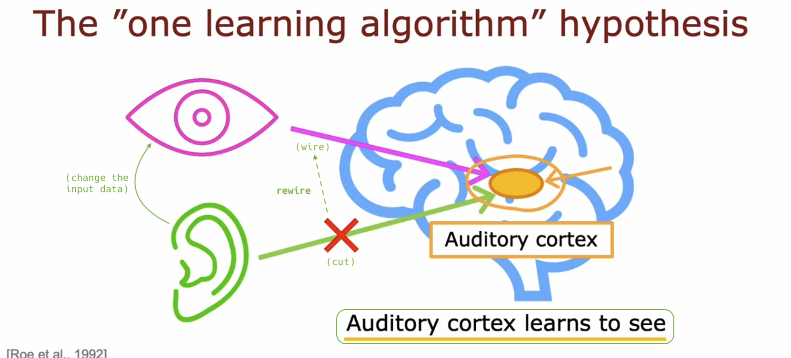
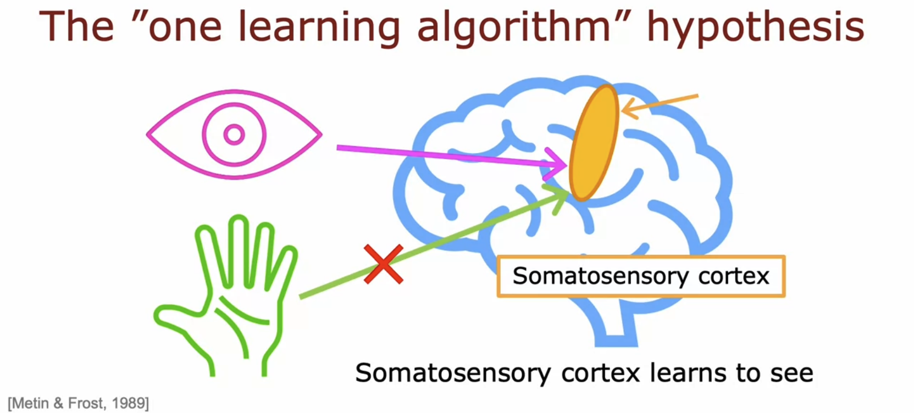
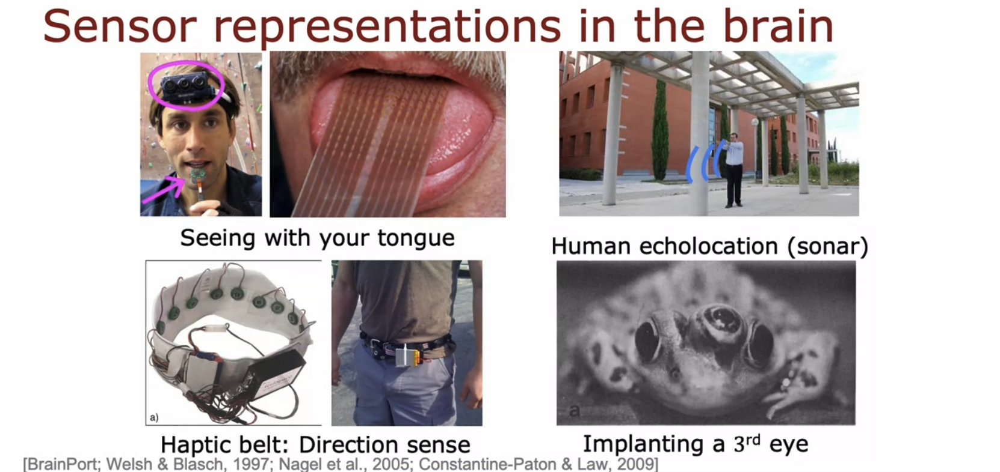

# Speculations on artificial general intelligence (AGI)

## Is there a path to AGI?

- Just because **ANI** has made explosive progress, it doesn't necessarily mean that **AGI** has made advancements.

  

- Logistic regression units are far simpler than what biological neurons perform. 😭

  

- We still barely understand how the brain works. Fundamental questions remain about how neurons **map inputs to outputs**. 😭

  

- The "**one learning algorithm**" hypothesis:

  - When the piece of the brain is fed different data, it instead learns to hear, see, feel, etc. accordingly.

  - Maybe a lot of intelligence could be due to one or a small handful of learning algorithms.

  - If we could figure out what that algorithm is, and implement it in a computer, then we could have AGI. 😎

  

  

- The brain can adapt to a remarkable range of types of sensory input:

  - By mapping images from a camera attached to the head onto a grid attached to the tongue, blind people can learn to see using their tongue.

  - Humans, like bats, can learn to understand their surroundings from the echoes of clicking sounds.

  - Buzzers in the northernmost direction always vibrate slowly, becoming able to discern direction even without a belt.

  - Surgeries can implant a third eye onto a frog, and the brain flexibly integrates this input.

  
