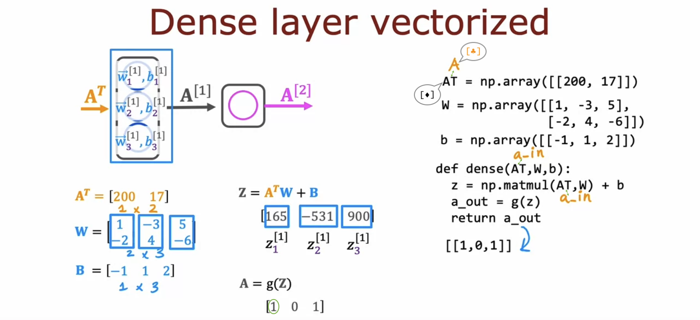

# Vectorization (optional)

## How neural networks are implemented efficiently

- Not only does GPU excel at large **matrix multiplications**, but some CPU functions, such as `np.matmul`, are also very efficient at this task.

  

## Matrix multiplication

- Vector vector multiplication:

  - **The dot product of vectors 'a' and 'w'** is equivalent to **the multiplication of the transposed vector 'a' with vector 'w'**.

  

- Vector matrix multiplication:

  

- Matrix matrix multiplication:

  

  

## Matrix multiplication rules

- General rules for matrix multiplication:

  

  

  

## Matrix multiplication code

- The Python built-in **@ operator** performs matrix multiplication between objects that implement the \_\_matmul\_\_ magic method.

  ```python
  >>> import numpy as np
  >>> AT = np.array([[1, 2], [-1, -2], [0.1, 0.2]])
  >>> W = np.array([[3, 5, 7, 9], [4, 6, 8, 0]])
  >>> np.matmul(AT, W)
  array([[ 11. ,  17. ,  23. ,   9. ],
         [-11. , -17. , -23. ,  -9. ],
         [  1.1,   1.7,   2.3,   0.9]])
  >>> AT @ W
  array([[ 11. ,  17. ,  23. ,   9. ],
         [-11. , -17. , -23. ,  -9. ],
         [  1.1,   1.7,   2.3,   0.9]])
  >>> has_matmul = hasattr(W, '__matmul__')
  >>> print(f"Does W have __matmul__ method? {has_matmul}")
  Does W have __matmul__ method? True
  ```

  

- Vectorized implementation of a neural network:

  - The sigmoid of 165 is very close to 1, and thus, it is rounded to 1.

  - Both are valid perspectives and both variable names are correct:

    - [&diams;] In mathematics and linear algebra, vectors (**a**) are typically represented as **column vectors**, with their transposes (**a<sup>T</sup>**) being **row vectors**.

    - [&clubs;] In machine learning, it is common to **arrange individual examples in rows** within the matrix [X](https://github.com/shisotem/stanford-andrew-ng-ml-dl/blob/main/s1_machine_learning_specialization/c2_advanced_learning_algorithms/w1_neural_networks/05_tensorflow_implementation/resources/notes/13.png), and TensorFlow follows this convention. So, we can also name this variable as [A_in](https://github.com/shisotem/stanford-andrew-ng-ml-dl/blob/main/s1_machine_learning_specialization/c2_advanced_learning_algorithms/w1_neural_networks/10_vectorization_optional/resources/notes/01.png) instead of AT.

  
