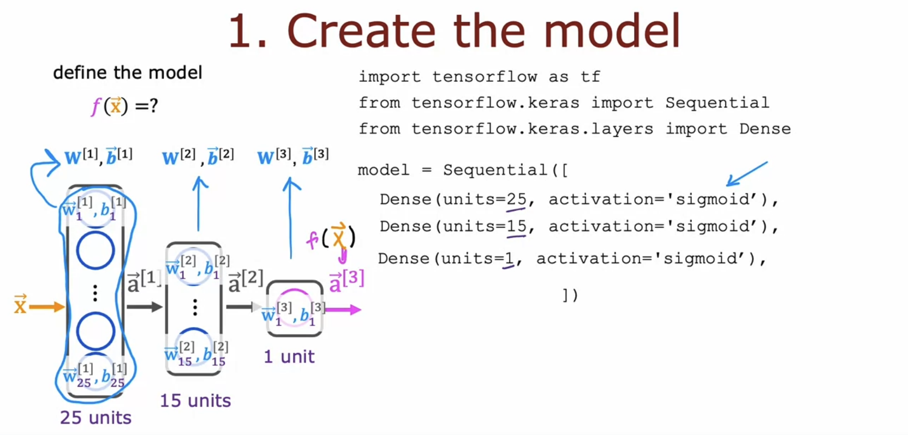
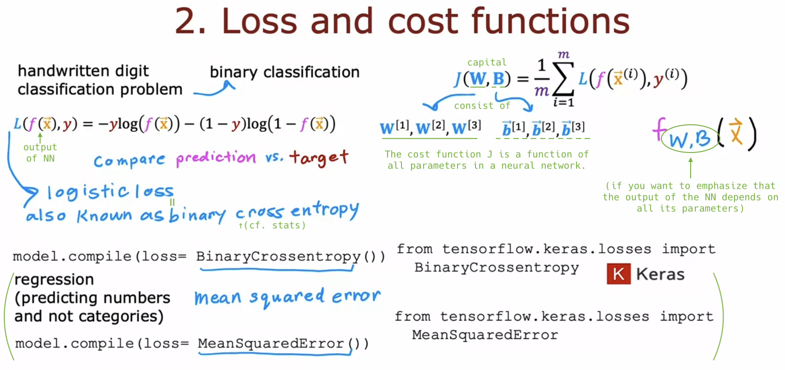

# Neural Network Training

## TensorFlow implementation

- "Train" a neural network in TensorFlow (in 3 steps):

  - `epochs=100` means the **entire** training set is passed through the neural network 100 times.

  

## Training Details

- Let's recall how you trained a logistic regression model:

  

- Details of training a neural network:

  

  - `tensorflow.keras`: This is the **Keras** library, which was originally developed independently, but eventually got merged into the TensorFlow framework.

  
