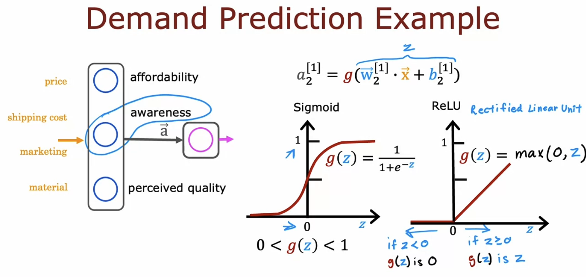
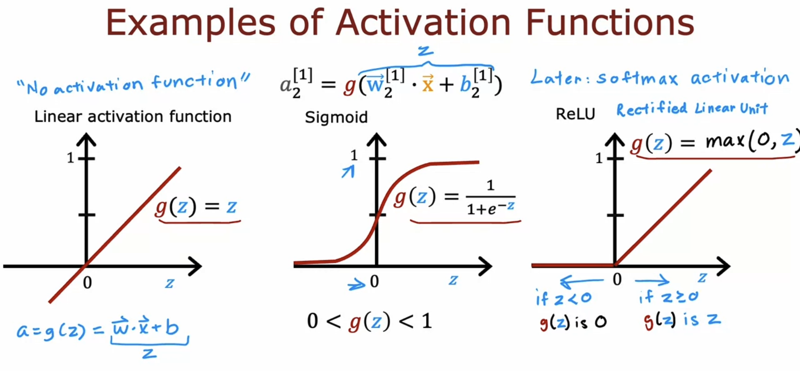

# Activation Functions

## Alternatives to the sigmoid activation

- If you use activation functions other than sigmoid, your neural network can become much more powerful.

  - sigmoid &rarr; It assumes that awareness is binary (0 or 1) or a number between 0 and 1.
  - ReLU &rarr; It suggests that awareness could range from 0 up to very large numbers.

  

- The most commonly used activation functions in neural networks:

  - When using the **linear activation function** g(z), people sometimes say, "we're **not using any activation function**" because the output is the same as the input, which is just z = w&middot;x + b.

  

## Choosing activation functions

## Why do we need activation functions?

## ReLU activation
