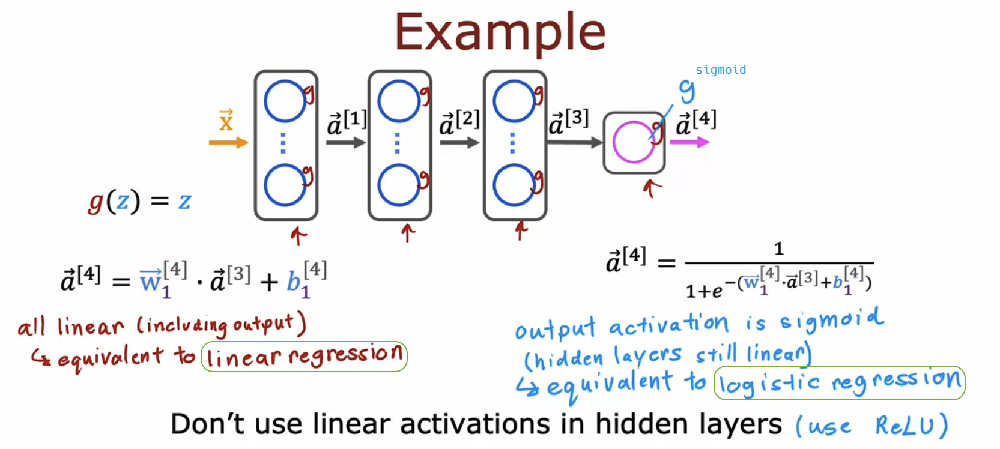

# Activation Functions

## Alternatives to the sigmoid activation

- If you use activation functions other than sigmoid, your neural network can become much more powerful.

  - sigmoid &rarr; It assumes that awareness is binary (0 or 1) or a number between 0 and 1.
  - ReLU &rarr; It suggests that awareness could range from 0 up to very large numbers.

  

- The most commonly used activation functions in neural networks:

  - When using the **linear activation function** g(z), people sometimes say, "we're **not using any activation function**" because the output is the same as the input, which is just z.

  

## Choosing activation functions

- You can choose different activation functions for different neurons in your neural network.

- Output layer:

  

- Hidden layers:

  - Early neural network development used sigmoid functions, but today's practitioners **predominantly** use **ReLU** activation.

    - (ReLU is faster to compute than sigmoid as it only requires max(0, z), avoiding exponentiation and inversion.)

    - Importantly, **using an activation function g(z) that is flat in many areas significantly slows down the gradient descent for the cost function J(W, B)**. In just an intuitive explanation, the activation function is part of the computation, this leading to **more flat areas with small gradients in the cost function J(W, B)**, which slows down learning.

  

- To recap:

  

- Other activation functions: LeakyReLU, tanh, Swish, etc.

  - I've used LeakyReLU a few times in my work, and sometimes it works a little bit better than ReLU. But I think for the most part, and for the vast majority of applications **what you learned about here would be good enough**.

## Why do we need activation functions?

- If we were to use the linear activation function in every neuron of the neural network, it wouldn't work.

  

- Why "linear regression"? - Explanation with a simpler example:

  

  

## ReLU activation
