# Multiclass Classification

## Multiclass

- e.g. Classify pictures of pills into categories: scratch, discoloration, chip, etc.

  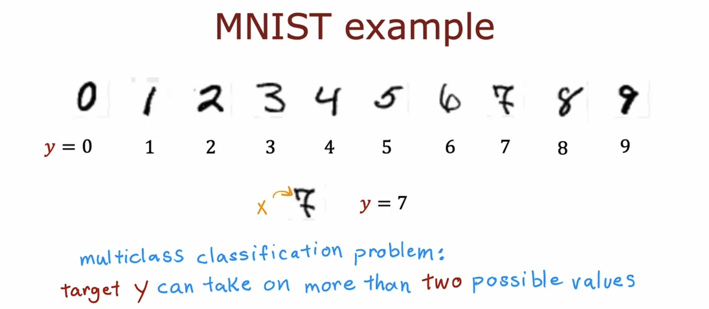

  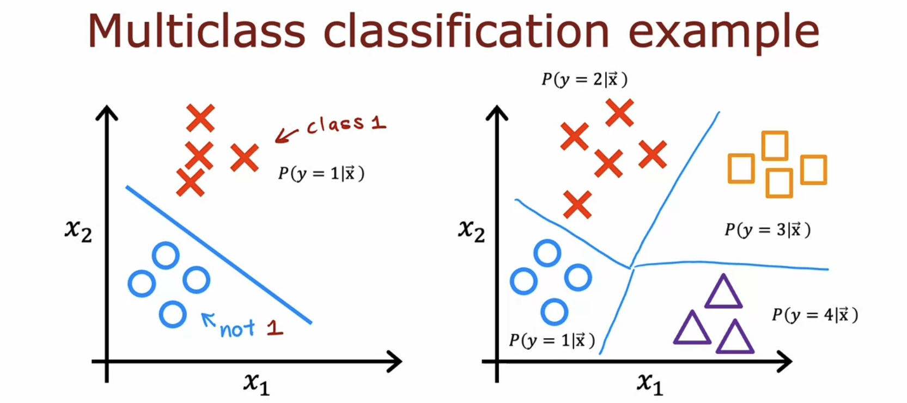

## Softmax

- The **softmax regression** algorithm is a generalization of the logistic regression algorithm.

  - If you apply softmax regression with N equals 2, the parameters end up being a little bit different, but it ends up reducing to the logistic regression model.

  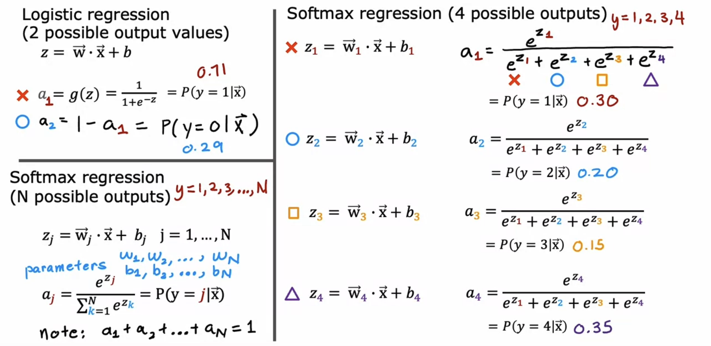

- If y is equal to 2, the loss for this example is the negative log of the probability that y was predicted to be 2. (Note: we do not compute the negative log of a1 or any other terms in this case.)

  - If y = j, the smaller aj is, the bigger the loss.

  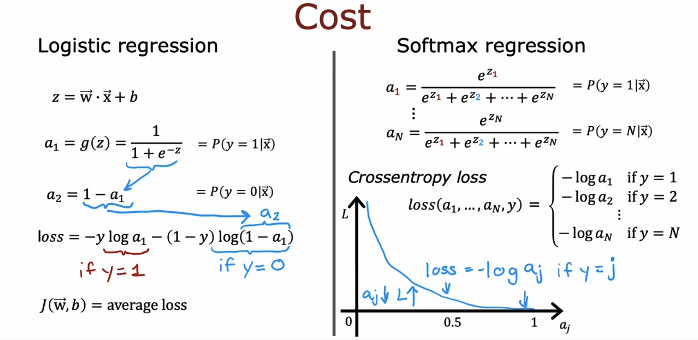

## Neural Network with Softmax output

- This neural network includes a **softmax activation function**, has a **softmax layer** as the output layer, and produces **softmax output**.

- Unique properties of a softmax activation function:

  - (sigmoid, ReLU, linear: a1 is a function of z1)

  - softmax: a1 is a function of z1, z2, ..., zN

  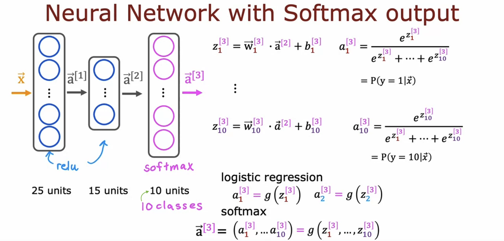

- Specify the loss function in Step 2:

  - (For binary classification, use BinaryCrossentropy also known as logistic loss.)

  - For multiclass classification, use **SparseCategoricalCrossentropy**.

    - "Sparse" indicates that y can only take on one of these 10 values (0 ~ 9).

  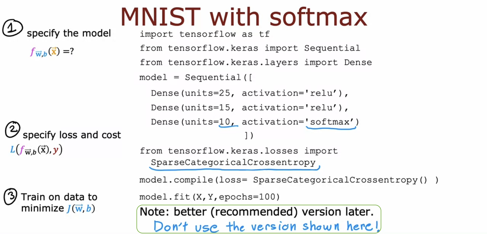

## Improved implementation of softmax

- The computer has only a **finite** amount of memory to store each number, called a floating-point number in this case. So, depending on **how we compute** the value 2/10000, the result can have more or less numerical **round-off error**.

  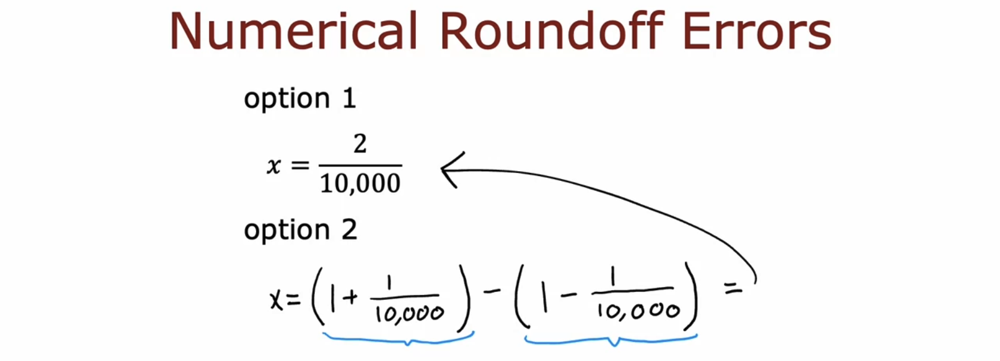

  

- There's an alternative method to formulate the cost function for softmax. This method helps **reduce these round-off errors**, resulting in more precise calculations in TensorFlow.

- Logistic regression:

  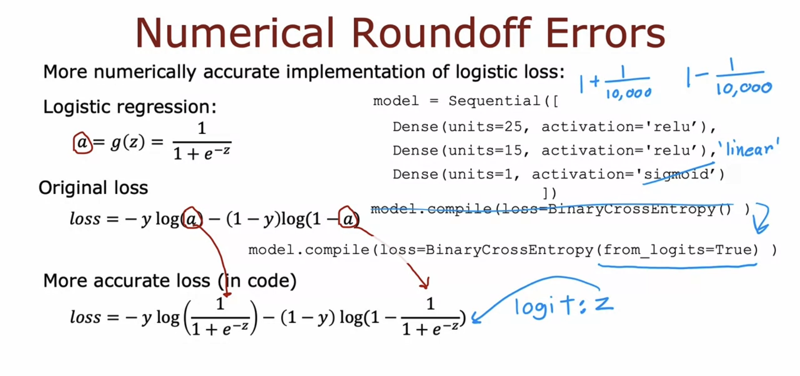

  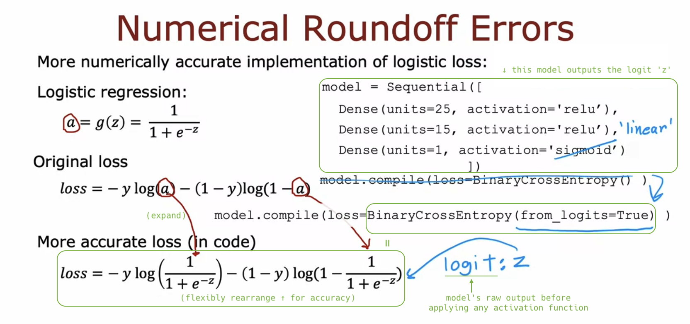

- Softmax regression:

  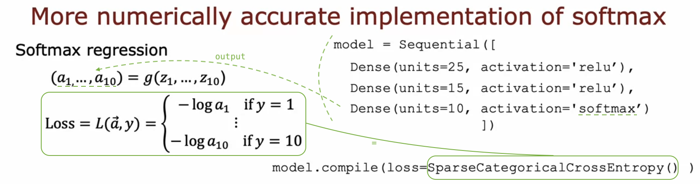

  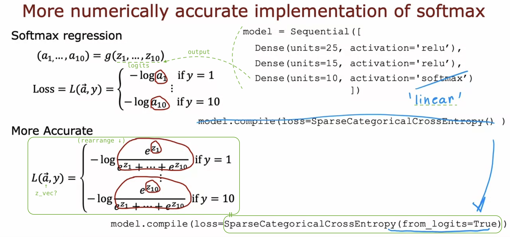

- More details:

  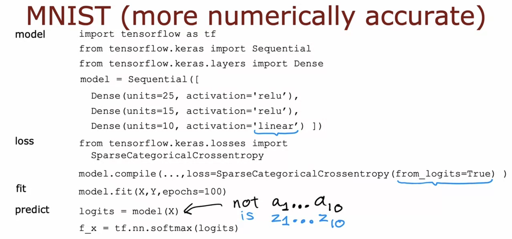

  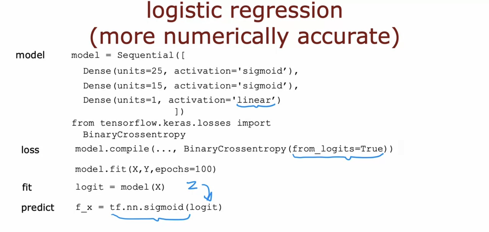

## Classification with multiple outputs (Optional)

## Softmax

## Multiclass
