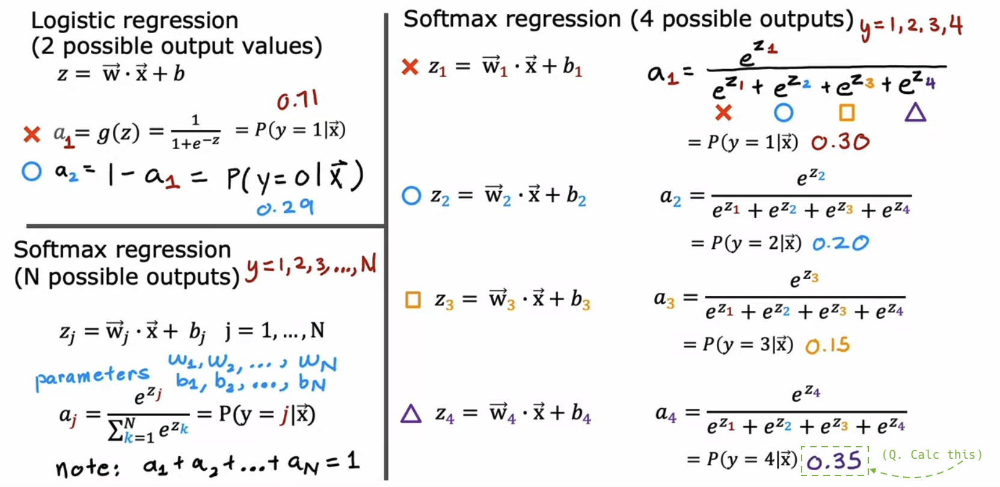
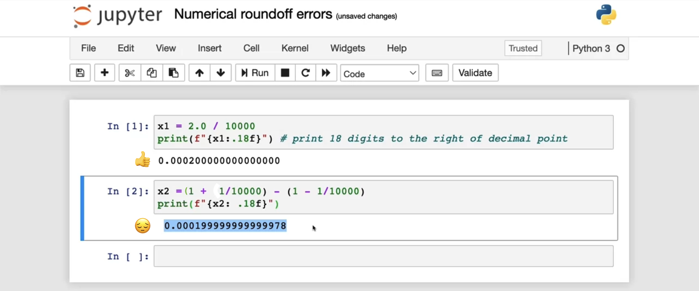
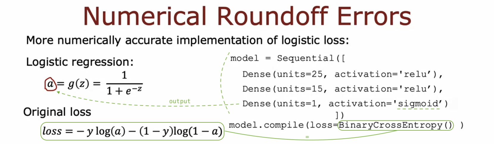
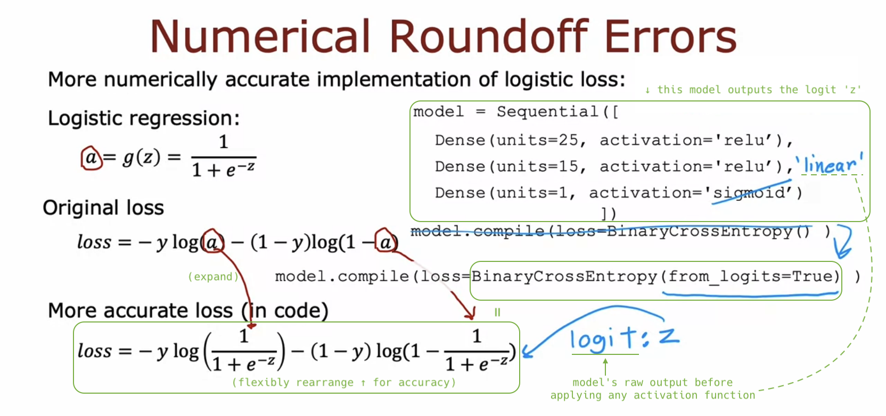

# Multiclass Classification

## Multiclass

- e.g. Classify pictures of pills into categories: scratch, discoloration, chip, etc.

  

  

## Softmax

- The **softmax regression** algorithm is a generalization of the logistic regression algorithm.

  - If you apply softmax regression with N equals 2, the parameters end up being a little bit different, but it ends up reducing to the logistic regression model.

  

- If y is equal to 2, the loss for this example is the negative log of the probability that y was predicted to be 2. (Note: we do not compute the negative log of a1 or any other terms in this case.)

  - If y = j, the smaller aj is, the bigger the loss.

  

## Neural Network with Softmax output

- This neural network includes a **softmax activation function**, has a **softmax layer** as the output layer, and produces **softmax output**.

- Unique properties of a softmax activation function:

  - (sigmoid, ReLU, linear: a1 is a function of z1)

  - softmax: a1 is a function of z1, z2, ..., zN

  

- Specify the loss function in Step 2:

  - (For binary classification, use BinaryCrossentropy also known as logistic loss.)

  - For multiclass classification, use **SparseCategoricalCrossentropy**.

    - "Sparse" indicates that y can only take on one of these 10 values (0 ~ 9).

  

## Improved implementation of softmax

- The computer has only a **finite** amount of memory to store each number, a floating-point number in this case. Therefore, depending on **how we compute** the value 2/10000, the result can have more or less numerical **round-off error**.

  

  

- There's an alternative method to formulate the loss function for softmax. This method helps **reduce round-off errors**, resulting in more precise calculations in TensorFlow.

- Explanation using logistic regression:

  - Tell TensorFlow to compute 'a' as an **intermediate** term (This is also a model's final output). Then, compute the loss using **precalculated** 'a'. This is like (1 + 1/10000) - (1 - 1/10000), where (1 + 1/10000) and (1 - 1/10000) are intermediate terms.

  - (For **logistic regression**, this implementation works **okay**, and usually the numerical round-off errors aren't that bad.)

  

  - However, to prevent TensorFlow from computing 'a' as an intermediate term, I **expanded 'a' (which is the sigmoid function) directly into the loss function**. And then, TensorFlow **flexibly mixes or rearranges the terms** within the loss function, to compute the loss in a more numerically accurate way. This is like 2/10000.

  - The output layer with `activation='linear'` computes the **logit** 'z', not the final probability 'a'. The loss function, set with `model.compile(loss=BinaryCrossentropy(from_logits=True))`, takes this logit 'z' from the model's output and applies it to **a loss function that is flexibly composed with a sigmoid function**.

  

- Improvement in softmax regression implementation:

  - (For logistic regression, **both** implementations actually **perform well**. However, when it comes to softmax, the implementation shown below can **exacerbate numerical round-off errors**.)

  

  - For example, when z2 is very small, ez2 also becomes very small, and when z4 is very large, ez4 becomes very large. By flexibly rearranging terms within the loss function, we can **avoid these extremely small or large values** and calculate the loss more accurately.

  

- Entire code up to 'predict':

  

  

## Classification with multiple outputs (Optional)

## Softmax

## Multiclass
