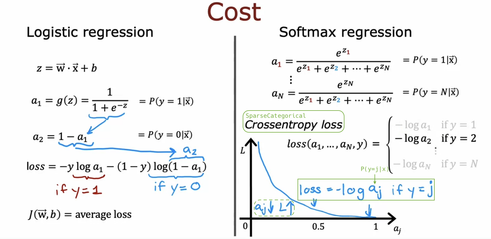

# Multiclass Classification

## Multiclass

- e.g. Classify pictures of pills into categories: scratch, discoloration, chip, etc.

  

  

## Softmax

- The **softmax regression** algorithm is a generalization of the logistic regression algorithm.

  - asdf

  

  

## Neural Network with Softmax output

## Improved implementation of softmax

## Classification with multiple outputs (Optional)

## Softmax

## Multiclass
