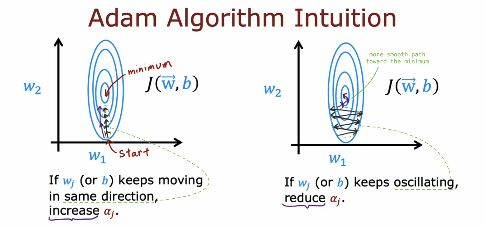

# Additional Neural Network Concepts

## Advanced Optimization

- **Adam**, an optimization algorithm faster than gradient descent, is the **de facto standard** for practitioners training neural networks.

  - It **adjusts the learning rate automatically**.

  

  - It uses **different learning rates for each parameter**.

  

  - Details on Adam's automatic learning rate adjustment aren't covered in this course. (&rarr; Learn more about Adam in the DL Specialization)

  

- How you implement Adam:

  - Adam requires an initial learning rate, like 10-3. It's more **robust** to your initial learning rate choice than gradient descent as it can slightly adjust the learning rate automatically. Still, it's **beneficial to try a few values** for this default global learning rate to somewhat speed up the learning.

  

## Additional Layer Types
