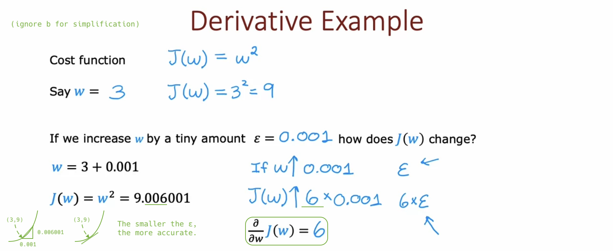
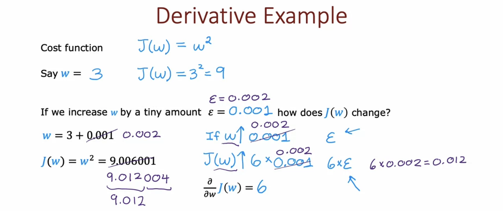
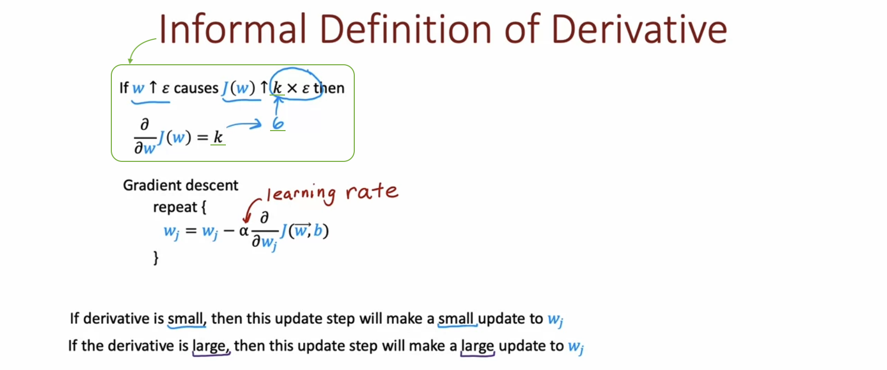
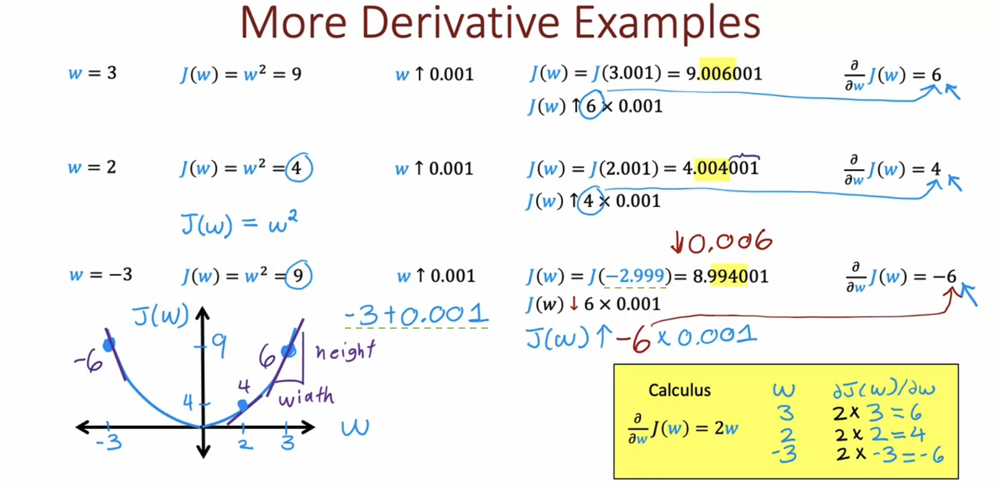
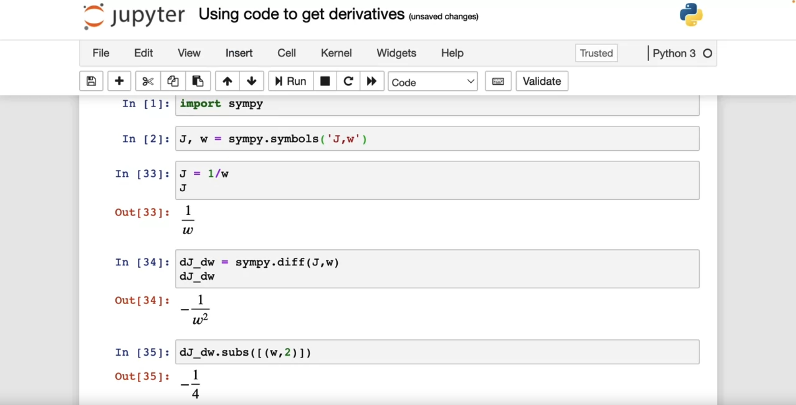
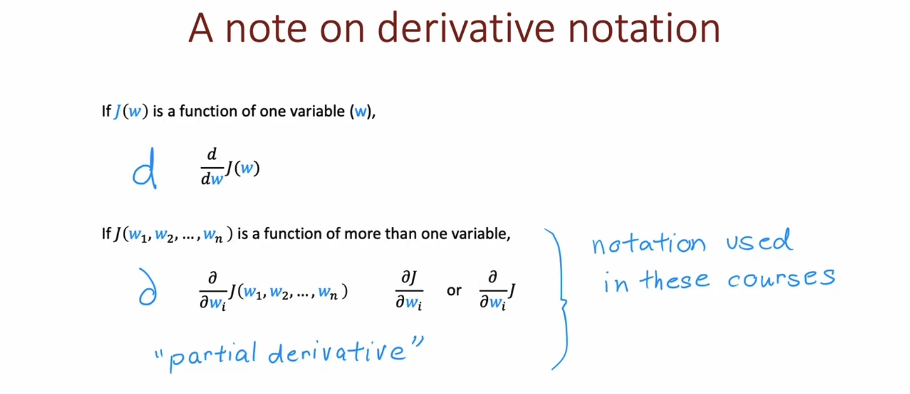

# Back Propagation (Optional)

## What is a derivative? (Optional)

## Computation graph (Optional)

## Larger neural network example (Optional)

## Optional Lab: Derivatives

## Optional Lab: Back propagation
