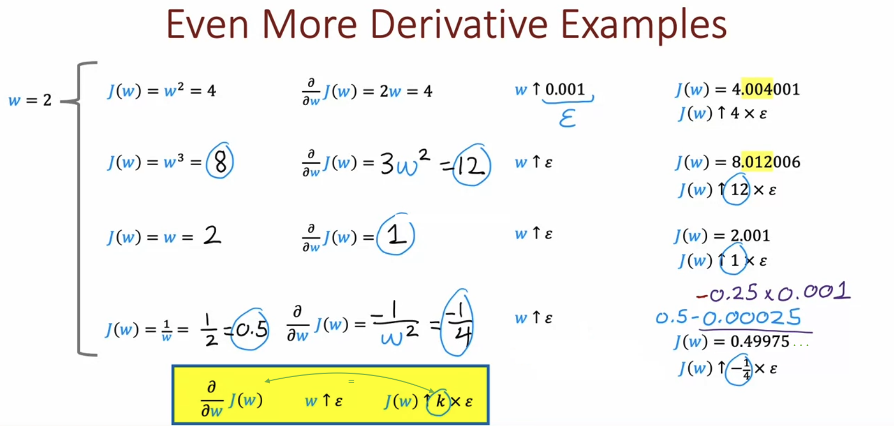
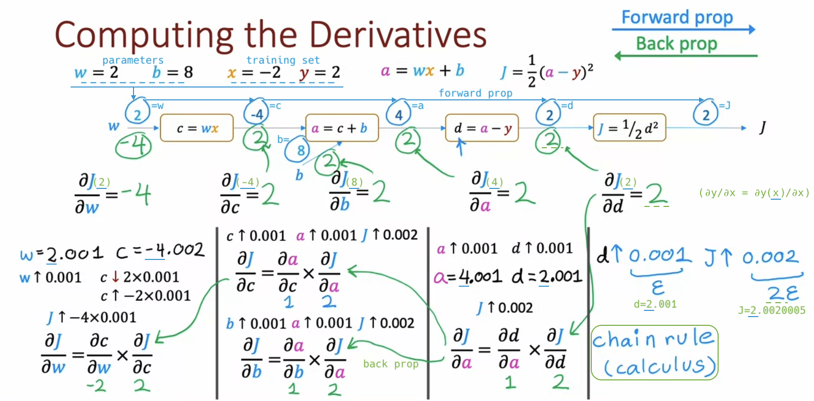
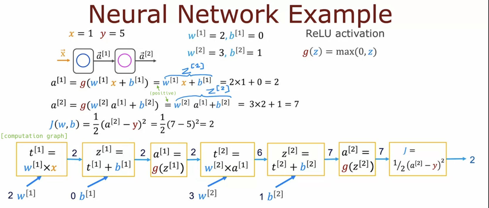

# Back Propagation (Optional)

## What is a derivative? (Optional)

> [!IMPORTANT]
>
> In TensorFlow, you specify a neural network architecture, fW,B(x), and a loss function, L(fW,B(x),y). Adam then trains the network parameters using the **derivatives computed by back propagation**.

- ∂J(w)/∂w = 6: **"If w goes up by a tiny little amount ε, J(w) goes up 6 times as much."**

  

  

  

- Derivative examples:

  

  

  

- Notation:

  

## Computation graph (Optional)

- Forward prop:

  

- **Forward prop &rarr; (remember w, c, b, a, d, J) &rarr; Back prop**:

  - For example, if d increases from 2 to 2.001 (+0.001), then J increases from 2 to 2.0020005 (+0.002). Therefore, **∂J/∂d** = 2.

  - **Chain rule**: ∂J/∂w = (((**∂J/∂d**) \* ∂d/∂a) \* ∂a/∂c) \* ∂c/∂w

  

  - Manually verify that ∂J/∂w equals -4:

  

- The efficiency of backprop:

  

> [!NOTE]
>
> - 🤯 Numerical Differentiation: ∂J(w)/∂w = (J(w+ε) - J(w-ε)) / 2ε. For example, as ε=1-4.
>
> - 🤯 Symbolic Differentiation: both the input and output are **expressions**, not values. For instance, the derivative of x2 with respect to x is 2x.
>
> - 😎 **Automatic Differentiation** (Back Propagation): use the **chain rule** to compute both derivatives **efficiently** and **accurately**.

## Larger neural network example (Optional)

- asdf

  

  

  

## Optional Lab: Derivatives

## Optional Lab: Back propagation
