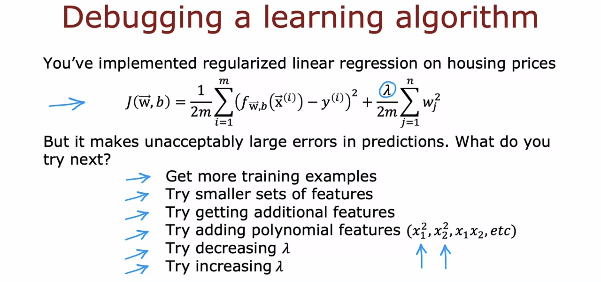
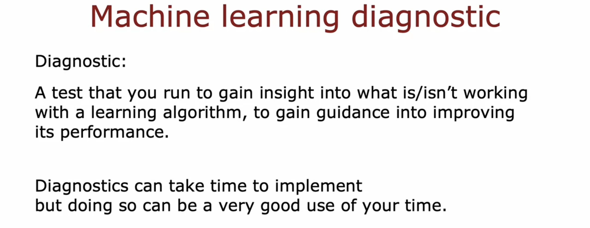

# Advice for applying machine learning

## Deciding what to try next

- A collection of tips on deciding **what to do next** in a machine learning project. This will help you use your time effectively.

  - Avoid spending a long time collecting data only to realize later that it was pointless.

  

  

## Evaluating a model

## Model selection and training/cross validation/test sets

## Optional Lab: Model Evaluation and Selection
