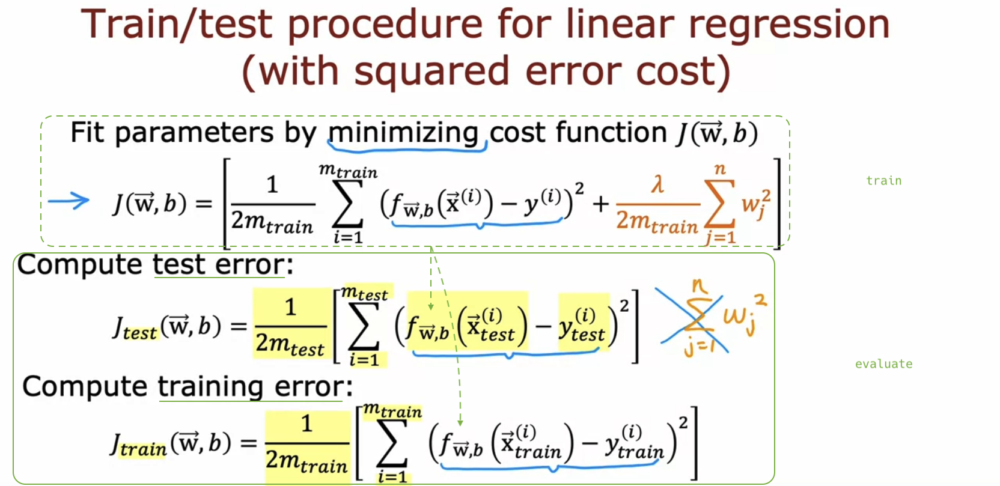

# Advice for applying machine learning

## Deciding what to try next

- This week, you'll learn a set of tips for determining **what to do next** in a machine learning project. This will enable you to use your time more efficiently.

  - Avoid spending a long time collecting data only to realize later that it was pointless.

  

  

## Evaluating a model

- We need a more systematic approach than just plotting f(x) to evaluate the performance of your model.

  - For only x1 (single feature):

    - Fitting a fourth order polynomial to just five data points results in a very wiggly curve. From this, we can see that the generalization performance is low.

  - For x1, x2, x3, x4 (multiple features):

    - Firstly, it's inherently challenging to plot a four-dimensional function f(x).

  

- Splitting the dataset into ratios such as 70-30 or 80-20.

  

- Using the model fw,b(x) trained only on the training set, calculate **training error Jtrain(w,b)** and **test error Jtest(w,b)**.

  

  - If Jtrain(w,b) is low but Jtest(w,b) is high, it suggests the model performs well on the training set but fails to generalize to unseen data. &rarr; **Overfitting**

  

- In the context of applying machine learning to **classification problems**,

  

  - there's an alternative, and perhaps **more common**, definition of Jtest(w,b) and Jtrain(w,b):

  - Rather than using logistic loss to compute test and training errors, it measures **the proportion of the test set and training set that the algorithm has misclassified**.

  

## Model selection and training/cross validation/test sets

## Optional Lab: Model Evaluation and Selection
