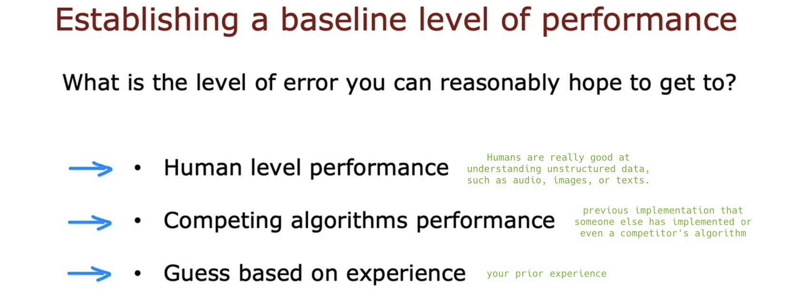

# Bias and variance

## Diagnosing bias and variance

- The **most powerful diagnostic** that I know of and have used for a lot of machine learning applications, is "bias and variance". This gives you very good guidance on **what to try next**.

- A systematic way to diagnose whether your algorithm has high bias or high variance, using **training and dev error** metrics (not depending on plotting):

  - **Jtrain is high** &rarr; high bias

  - Jtrain is low & Jcv is also pretty low &rarr; just right!

  - **Jcv >> Jtrain** &rarr; high variance

  

- A different view on bias and variance:

  

  - **Most** learning applications have either high bias or high variance, **not both**. However, in some **neural network** applications, you might unfortunately encounter **both issues simultaneously**.

  

- When training machine learning algorithms, I almost always try to understand to what extent the algorithm has a problem with high bias (underfitting) or high variance (overfitting).

  - This provides good guidance on how to improve the performance of the algorithm, as we will see later this week.

## Regularization and bias/variance

- How can you choose a good value of &lambda;?

  

  - This procedure is similar to the procedure to choose d (degree of polynomial) using cross-validation.

  

  - Assess the cross-validation error for various &lambda;/d values, and choose the &lambda;/d that yields the lowest error for a hopefully good model.

  

## Establishing a baseline level of performance

- If even a human makes a 10.6% error, then it seems difficult to expect a learning algorithm to perform significantly better than it.

  - Jtrain=10.8% means that your model accurately transcribes 89.2% of your training set, but makes errors in the remaining 10.8%.

  

- **Baseline level of performance** refers to the level of error that you can reasonably hope your learning algorithm to eventually achieve.

  

- (Note: There are occasional cases where the baseline level is 0%.)

  

## Learning curves

- Learning curves (For fw,b(x) = w1x + w2x2 + b):

  - It may not be surprising that as the training set size gets bigger, the model improves and so the cross-validation error goes down.

  - The cross-validation error will typically be higher than the training error, as the parameters are fitted to the training set.

  

- High bias (fw,b(x) = w1x + b):

  - Given that this model is **too simple** (**high bias**), even if there is **more data**, both errors will just **plateau** and **Jcv cannot approach the baseline level** of performance almost forever.

  

## Deciding what to try next revisited

## Bias/variance and neural networks

## Optional Lab: Diagnosing Bias and Variance
