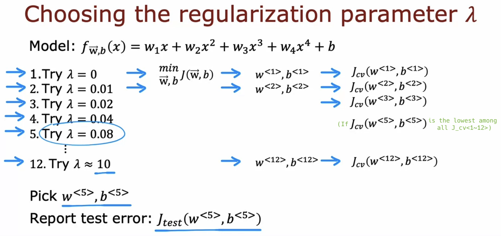
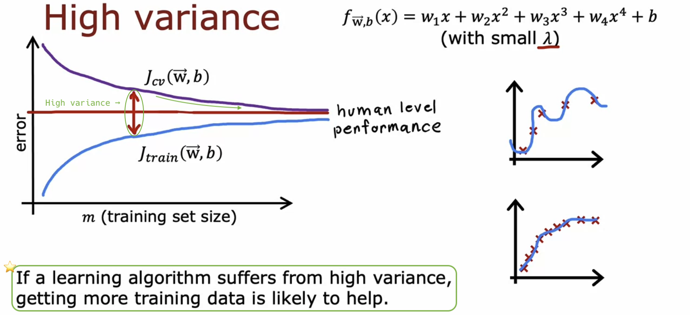
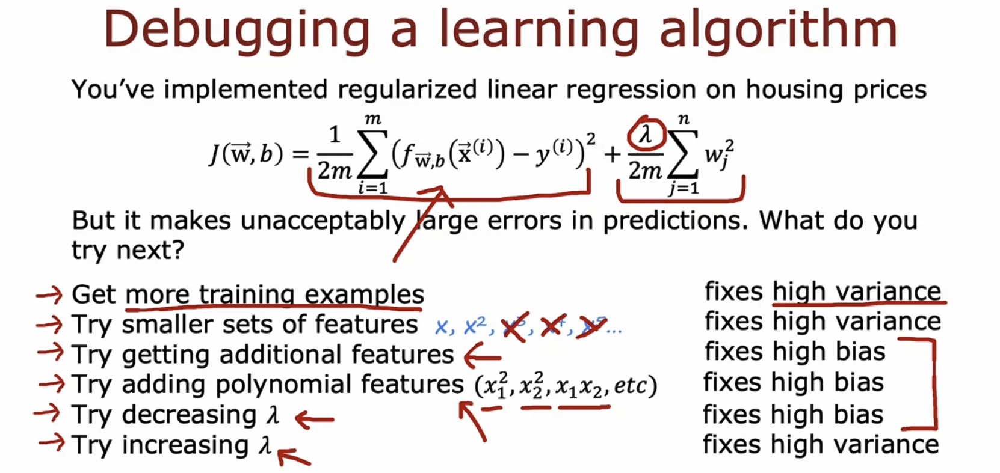
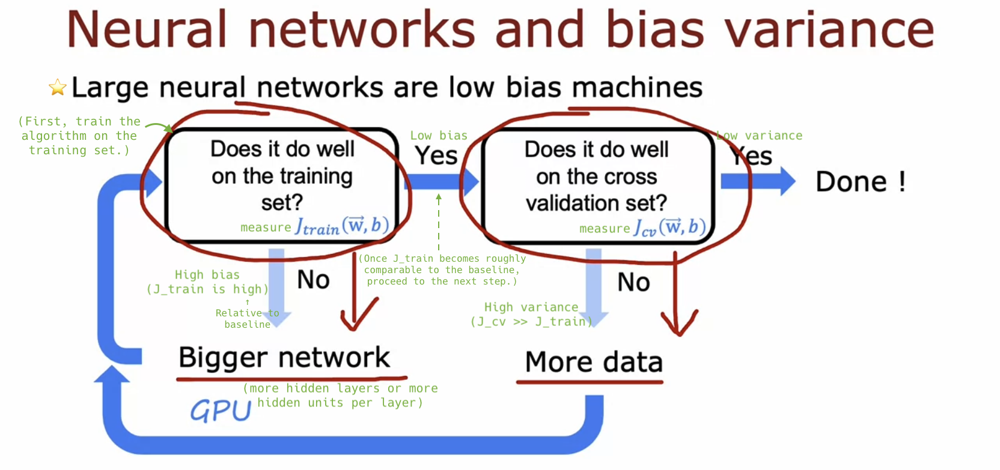

# Bias and variance

## Diagnosing bias and variance

- **The most powerful diagnostic** that I know of and have used for a lot of machine learning applications, is **"bias and variance"**. This gives you very good guidance on **what to try next**.

- A systematic way to diagnose whether your algorithm has high bias or high variance, using **training and dev error** metrics (not depending on plotting):

  - **Jtrain is high** &rarr; high bias

  - Jtrain is low & Jcv is also pretty low &rarr; just right!

  - **Jcv >> Jtrain** &rarr; high variance

  

- A different view on bias and variance:

  

  - **Most** learning applications have either high bias or high variance, **not both**. However, in some **neural network** applications, you might unfortunately encounter **both issues simultaneously**.

  

- When training machine learning algorithms, I almost always try to understand to what extent the algorithm has a problem with high bias (underfitting) or high variance (overfitting).

  - This provides good guidance on how to improve the performance of the algorithm, as we will see later this week.

## Regularization and bias/variance

- How can you choose a good value of &lambda;?

  

  - This procedure is similar to the procedure to choose d (degree of polynomial) using cross-validation.

  

  - Assess the cross-validation error for various &lambda;/d values, and choose the &lambda;/d that yields the lowest error for a hopefully good model.

  

## Establishing a baseline level of performance

- If even a human makes a 10.6% error, then it seems difficult to expect a learning algorithm to perform significantly better than it.

  - Jtrain=10.8% means that your model accurately transcribes 89.2% of your training set, but makes errors in the remaining 10.8%.

  

- **Baseline level of performance** refers to the level of error that you can reasonably hope your learning algorithm to eventually achieve.

  

- (Note: There are occasional cases where the baseline level is 0%.)

  

## Learning curves

- **Learning curves** (for fw,b(x) = w1x + w2x2 + b):

  - It may not be surprising that as the training set size gets bigger, the model improves and so the cross-validation error goes down.

  - The cross-validation error will typically be **higher** than the training error, as the parameters are fitted to the training set.

  

- High bias (fw,b(x) = w1x + b):

  - Given that this model is **too simple** (**high bias**), even if there is **more data**, both errors will just **plateau** and **Jcv cannot approach the baseline level** of performance almost forever.

    - **Before investing** a lot of effort into collecting more training data, **ensure** your learning algorithm doesn't have a **high bias**.

  - If we could fit a **more complex** function than a straight line, we could expect significantly better results.

  

- High variance (fw,b(x) = w1x + w2x2 + w3x3 + w4x4 + b):

  - The baseline may occasionally be higher than Jtrain, or might be slightly lower than Jtrain.

    - If the model is overfitting to the training set, Jtrain may become unrealistically small, and it may perform better than a human's ability to predict housing prices.

  - In this example (**high variance**), simply by obtaining **more training data**, we can bring **Jcv significantly closer to the baseline.**

  

- Due to the high computational cost, it's not done very often, but by increasing mtrain to 100, 200, etc., and plotting Jtrain and Jcv, you might gain some insights from learning curves.

## Deciding what to try next revisited

- When training a learning algorithm, **I routinely** examine Jtrain and Jcv to determine if the algorithm has high bias or high variance. This gives me very good guidance on what to try next.

- "Try smaller sets of features":

  - (Just like when the degree of the polynomial is too high,) if your learning algorithm has too many features, it gives your algorithm too much flexibility to fit very complicated models.

  - By reducing the number of features that are not helpful or somewhat redundant in predicting housing prices, you can prevent overfitting.

- "Try getting additional features":

  - If you're predicting housing prices based solely on size, but price also depends on factors like number of bedrooms, floors, and house age, the algorithm won't perform well without these additional features.

  

> [!IMPORTANT]
>
> - For high bias:
>
>   - Use a more powerful or complex model (add more features, include polynomial features, or decrease &lambda;)
>
> - For high variance:
>
>   - Get more training data
>
>   - Simplify the model (reduce features, exclude polynomial features, or increase &lambda;)

- Note: A smaller training set size leads to a decrease in Jtrain but an increase in Jcv, i.e., it worsens algorithm performance. **Don't discard training examples** to fix high bias.

- The concepts of bias and variance are easy to grasp initially, but mastering them requires a lifetime. **Consistent practice is essential for mastery.**

## Bias/variance and neural networks

- Before the days of neural networks, ML engineers talked a lot about **bias-variance tradeoff** in which you have to balance d and &lambda; to make bias and variance both not be too high.

  

- (As long as your **training set is not enormous**,) **if you make your neural network large enough, you can lower bias, i.e, you can almost always fit your training set well.**

  - "I'm often fighting **variance problems** rather than bias problems, at least if the neural network is large enough."

  - Let's look at a new way to reduce bias or reduce variance **as needed** without needing to really tradeoff between them.

- (If applicable) A very powerful procedure:

  - Limitations:

    - Even with GPUs, once the neural network becomes large beyond a certain point, it gets computationally expensive and takes so long to train that it becomes infeasible.

    - Sometimes, beyond a certain point it's hard to get much more data.

  - (However, I think this slide explains much of the rise of **DL** with **big data** in recent years!)

  

- Q. Won't an overly large neural network cause a serious high variance problem?

  - As long as it is properly regularized, a large neural network will perform as well as or better than a small one. In other words, **increasing the size of the neural network usually doesn't have negative effects, provided that appropriate regularization is applied**.

  

  

## Optional Lab: Diagnosing Bias and Variance
