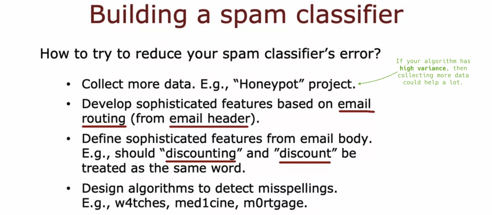

# Machine learning development process

## Iterative loop of ML development

- Iterative loop of ML development:

  

- Spam vs. Non-spam example:

  

- Spam classifier (**text classification**):

- There are many ways to construct a feature vector:

  - Check whether a word appears or not.

  

  - Or, count the number of times a word appears.

  

  - (Given these features, you can then train a classification algorithm such as a logistic regression or a neural network.)

- Multiple ideas for improving the learning algorithm's performance:

  - "Honey pot" project: Generate numerous fake email addresses to lure and collect a substantial amount of spam emails.

  - Emails contain header information, which includes details about email routing. Sometimes, the path that an email has traveled can help determine whether it was sent by a spammer or not.

  

- Given all of these and possibly even more ideas, how can you decide which ones are more promising? &rarr; **bias/variance**, **error analysis**

  

## Error analysis

## Adding data

## Transfer learning: using data from a different task

## Full cycle of a machine learning project

## Fairness, bias, and ethics
