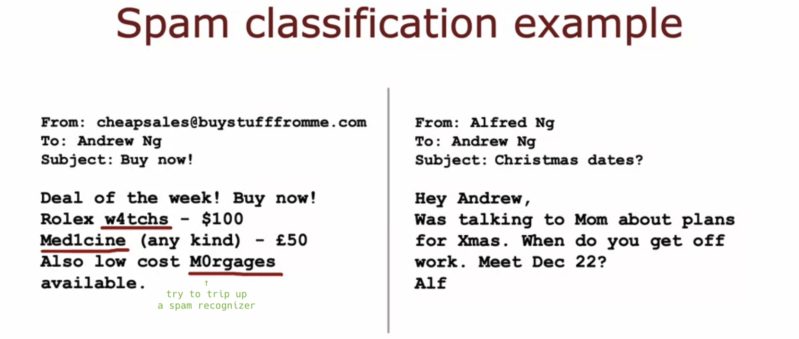

# Machine learning development process

## Iterative loop of ML development

- Iterative loop of ML development:

  

- Spam vs. Non-spam example:

  

- Spam classifier (**text classification**):

  

## Error analysis

## Adding data

## Transfer learning: using data from a different task

## Full cycle of a machine learning project

## Fairness, bias, and ethics
